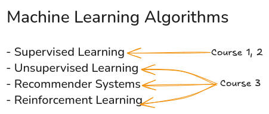
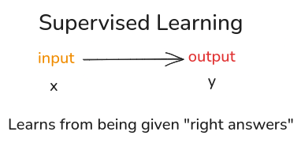
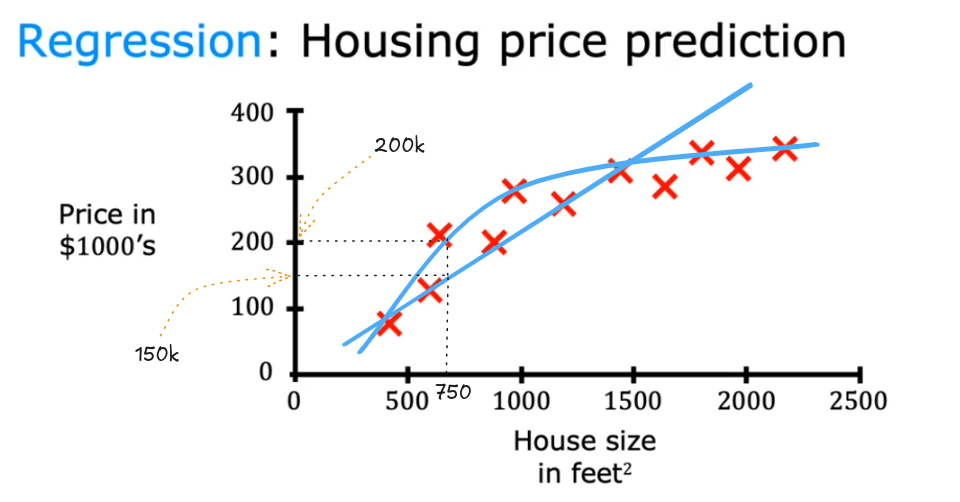
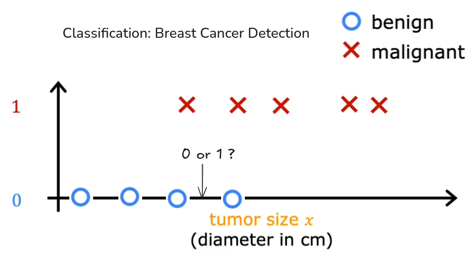

# Introduction to Machine Learning 
 **Learning Objectives**  
>- Define machine learning
>- Define supervised learning
>- Define unsupervised learning
>- Write and run Python code in Jupyter Notebooks
>- Define a regression model
>- Implement and visualize a cost function
>- Implement gradient descent
>- Optimize a regression model using gradient descent
### Supervised vs Unsupervised Machine Learning

**Definition of Machine Learning:**

- **Arthur Samuel's Definition:** Machine learning is "the field of study that gives computers the ability to learn without being explicitly programmed."  
- This emphasizes the computer's ability to improve its performance through experience, rather than relying on pre-defined rules.

**Example: Arthur Samuel's Checkers Program:**

- Samuel developed a checkers-playing program in the 1950s.  
- The program learned by playing thousands of games against itself.
- It analyzed game positions, identifying patterns that led to wins or losses.  
- Through this experience, the program surpassed Samuel's own checkers skills.
- The more games the computer played the better it became.

**Types of Machine Learning:**

- The lecture introduces two primary types:
    - **Supervised Learning:** This is the most widely used type, and it will be the focus of the first two courses in the specialization.
    - **Unsupervised Learning:** This type, along with recommender systems and reinforcement learning, will be covered in the third course.
    - Recommender systems are also very widely used.

**Practical Application and Best Practices:**

- The lecture emphasizes the importance of knowing how to apply machine learning tools effectively.
- It draws an analogy to providing someone with tools without instructions on how to build something.
- The specialization aims to teach both the tools and the skills to use them.
- It will cover best practices for developing practical and valuable machine learning systems.
- The lecture gave examples of experienced teams wasting time by applying machine learning in ineffective ways.
- The goal of the course is to give the student the knowledge to avoid those pitfalls.

---

**Definition of Supervised Learning:**

- Supervised learning involves algorithms that learn mappings from inputs (`x`) to outputs (`y`).  
- The key characteristic is that the algorithm is trained on examples where the "right answers" (correct labels, `y`) are provided for given inputs (`x`).  
- By learning from these input-output pairs, the algorithm can predict outputs for new, unseen inputs.

**Examples of Supervised Learning Applications:**

- **Spam Filtering:** Input (`x`) is an email, output (`y`) is "spam" or "not spam."  
- **Speech Recognition:** Input (`x`) is an audio clip, output (`y`) is a text transcript.  
- **Machine Translation:** Input (`x`) is text in one language, output (`y`) is the translated text in another language.  
- **Online Advertising:** Input (`x`) is information about an ad and a user, output (`y`) is whether the user will click on the ad.
- **Self-Driving Cars:** Input (`x`) is images and sensor data, output (`y`) is the position of other vehicles.
- **Manufacturing (Visual Inspection):** Input (`x`) is an image of a product, output (`y`) is whether the product has defects.

**The Training Process:**

- The model is trained on a dataset of input-output pairs `(x, y)`.  
- After training, the model can predict outputs for new inputs.

**Example: Housing Price Prediction (Regression):**

- Input (`x`) is the size of the house, output (`y`) is the price.
- The lecture demonstrates how a learning algorithm can fit a line or curve to the data to predict prices for new house sizes.
- The lecture points out that there are systematic ways for the program to choose the best fit for the data.
- The lecture explains that because the data set contained the correct price (`y`) for each house size(`x`) that this is supervised learning.

**Regression vs. Classification:**

- **Regression:** Predicts numerical outputs from an infinite range of possibilities (e.g., house prices).  
- **Classification:** Predicts categorical outputs from a finite, limited set of possibilities (e.g., benign or malignant).
---

**Breast Cancer Detection Example:**

- A machine learning system is designed to help doctors detect breast cancer.  
- The system analyzes patient medical records to determine if a tumor is:
    - **Benign (0):** Non-cancerous, not dangerous.  
    - **Malignant (1):** Cancerous, dangerous.  
- Data is plotted with tumor size on the horizontal axis and benign/malignant (0/1) on the vertical axis.
- This demonstrates a binary classification problem (two possible outputs).

**Key Characteristics of Classification:**

- Predicts a small, finite number of output categories.
- Categories can be numerical (0, 1, 2) or non-numerical (cat, dog).  
- The focus is on assigning inputs to specific categories, not predicting continuous values.  
- The terms output classes and output categories are interchangeable.

**Expanding Classification Categories:**

- Classification can involve more than two categories.
- For example, a cancer diagnosis system could predict multiple types of cancer (e.g., Benign, Malignant-type 1, Malignant-type 2).
