# Introduction to Machine Learning 

 **Learning Objectives:**  
- Define machine learning
- Define supervised learning
- Define unsupervised learning
- Write and run Python code in Jupyter Notebooks
- Define a regression model
- Implement and visualize a cost function
- Implement gradient descent
- Optimize a regression model using gradient descent

---

### Supervised vs. Unsupervised Machine Learning

#### What is Machine Learning?

**Machine Learning** is defined as the field of study that gives computers the ability to learn **without being explicitly programmed**.

The concept is best illustrated by Arthur Samuel’s 1950s checkers program:

- **The Innovation:** Instead of writing specific rules for every move, Samuel wrote a program that allowed the computer to learn through experience.
    
- **The Result:** Despite Samuel not being a strong checkers player himself, the computer eventually surpassed his own skill level by "learning" from the game data.

#### Types of Machine Learning:

- **Supervised Learning:** The most widely used in real-world applications and the primary focus of the first two courses.
    
- **Unsupervised Learning:** Used for finding patterns in data; covered in the third course.
    
- **Recommender Systems & Reinforcement Learning:** Additional specialized types of ML that will be explored later.

	

- **The "Tools vs. Skills" Philosophy:** Knowing the algorithms (the tools) is not enough. Just as having a hammer doesn't make you a carpenter, knowing an algorithm doesn't mean you know how to build a functioning system.
    
- **Focus on Practical Application:** A major goal of the course is to teach **best practices**. This helps avoid the common mistake of spending months on an approach that is destined to fail.

#### Supervised Learning

- **Economic Impact:** Supervised learning currently accounts for approximately **99% of the economic value** generated by machine learning.
    
- **The Core Mechanism ($x \rightarrow y$):** At its heart, supervised learning is about learning **input-to-output mappings**.
    
    - **Input ($x$):** The data you provide to the system.
        
    - **Output ($y$):** The prediction or "label" the system produces.
        
- **The "Supervision" Aspect:** The algorithm learns by being shown **"right answers."** You provide it with a dataset containing pairs of inputs and their correct corresponding labels.
    
- **The Goal:** By observing these correct pairs, the algorithm eventually learns to take a **new input ($x$)** on its own and produce a **reasonably accurate prediction ($y$)**.

	

**Examples of Supervised Learning Applications:**

| **Application**         | **Input (x)**              | **Output (y)**                        |
| ----------------------- | -------------------------- | ------------------------------------- |
| **Spam Filter**         | Email content              | Is it spam? (Yes/No)                  |
| **Speech Recognition**  | Audio clip                 | Text transcript                       |
| **Machine Translation** | English text               | Translated text (e.g., Spanish)       |
| **Online Advertising**  | Ad info + User info        | Will the user click? (Yes/No)         |
| **Self-Driving Cars**   | Camera image + Sensor data | Position of other cars                |
| **Manufacturing**       | Photo of a product         | Is it defective? (Scratch/Dent/Clean) |

**The Training Process:** In every case, the model is first **trained** on a dataset of known pairs (inputs with their "right answers"). Once trained, it can then process **new, unseen data** to predict the correct output.

**The Example:** Predicting the price of a house ($y$) based on its size ($x$) using historical data where the "right answers" (actual sale prices) are already known.
    
- **Model Fitting:** Algorithms can represent data in different ways to make predictions:
    
    - **Straight Line:** A simple linear approach.
        
    - **Curve:** A more complex function that may fit the data more accurately.
        
- **Systematic Choice:** A key part of machine learning is using mathematical methods to choose the most appropriate fit (line vs. curve) rather than just picking the one that gives a desired result.
#### Regression vs. Classification:

- **Regression:** Predicts numerical outputs from an infinite range of possibilities (e.g., house prices).  

- **Classification:** Predicts categorical outputs from a finite, limited set of possibilities (e.g., benign or malignant).

**Breast Cancer Detection Example:**

- A machine learning system is designed to help doctors detect breast cancer.  

- The system analyzes patient medical records to determine if a tumor is:

    - **Benign (0):** Non-cancerous, not dangerous.  

    - **Malignant (1):** Cancerous, dangerous.  

- Data is plotted with tumor size on the horizontal axis and benign/malignant (0/1) on the vertical axis.

- This demonstrates a binary classification problem (two possible outputs).

**Key Characteristics of Classification:**

- Predicts a small, finite number of output categories.

- Categories can be numerical (0, 1, 2) or non-numerical (cat, dog).  

- The focus is on assigning inputs to specific categories, not predicting continuous values.  

- The terms output classes and output categories are interchangeable.

**Expanding Classification Categories:**

- Classification can involve more than two categories.

- For example, a cancer diagnosis system could predict multiple types of cancer (e.g., Benign, Malignant-type 1, Malignant-type 2).

#### Unsupervised Learning

- **The Difference in Data:**
    
    - **Supervised Learning:** Data comes with "right answers" or labels ($y$), such as whether a tumor is malignant or benign.
        
    - **Unsupervised Learning:** Data is provided **without labels**. The algorithm is given inputs (like patient age and tumor size) but is not told what the "correct" outcome is.
        
- **The Goal:** Instead of predicting a specific label, the algorithm's job is to find **structure, patterns, or interesting relationships** within the data on its own.
    
- **Why "Unsupervised"?** It is called "unsupervised" because there is no teacher providing the correct answers. The algorithm must figure out the underlying distribution of the data without guidance.

**Clustering: A Primary Example**

- **Mechanism:** The algorithm looks at the data points and identifies natural groupings.
    
- **Example:** In a medical dataset without labels, the algorithm might automatically group data into two distinct "clusters" based on similarities it detects, even if it doesn't know what those clusters represent (e.g., healthy vs. sick).

	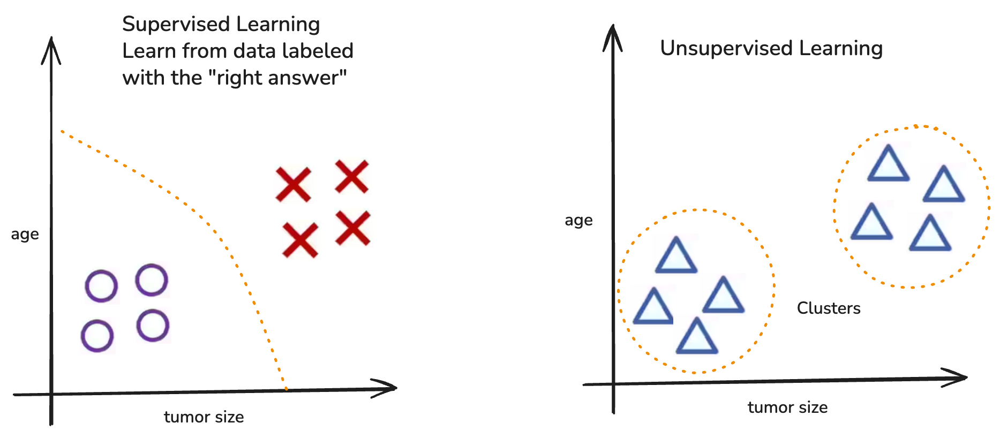

**Google News: How Clustering works in a real-world?**

- **Automated Organization:** Every day, Google News analyzes hundreds of thousands of articles and groups them into related stories without human intervention.
    
- **How the Algorithm "Thinks":** The clustering algorithm identifies patterns—such as the repeated appearance of specific words like "panda," "twin," and "zoo"—to determine that certain articles belong in the same group.
    
- **The "Unsupervised" Advantage:** **No Manual Labels:** There is no employee telling the computer which words to look for.
    
    - **Adaptability:** Because news topics change daily, the algorithm must independently figure out what is "interesting" or "related" for that specific day.
        
    - **Scalability:** It is physically impossible for humans to manually categorize the sheer volume of news generated globally; the algorithm handles this at scale.

	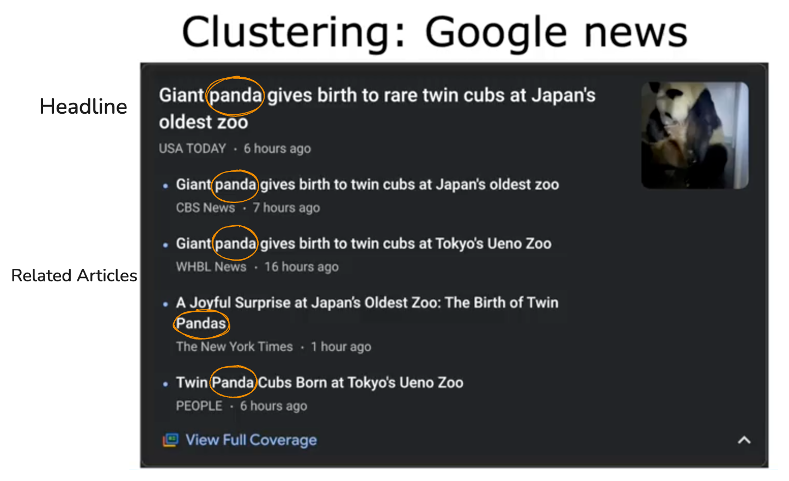

**Clustering: DNA Microarray**

- **The Data Structure:** Researchers use a grid where each column represents an individual's DNA and each row represents a specific gene (e.g., genes for eye color, height, or even a distaste for certain vegetables).
    
- **The Process:** The algorithm analyzes the "expression" of these genes (represented by colors like red or green) across many different people.
    
- **The Discovery:** A clustering algorithm can automatically group people into different "types" (e.g., Type 1, Type 2, Type 3) based on genetic similarities.
    
- **Why it's Unsupervised:** The researchers do **not** tell the algorithm what the types are in advance.
    
    - There are no "right answers" or labels provided.
        
    - The algorithm must **independently find the structure** and categorize the individuals based solely on the raw data.

**Three Types of Unsupervised Learning**

1. **Clustering:** Grouping similar data points together (e.g., Google News stories or DNA types).
    
2. **Anomaly Detection:** Identifying unusual events or outliers. This is critical for **fraud detection** in banking, where a strange transaction might indicate a stolen card.
    
3. **Dimensionality Reduction:** Compressing a large dataset into a smaller one while retaining as much vital information as possible.

---
### Regression Model

#### Introduction to Linear Regression

- **Definition:** Linear Regression is the process of **fitting a straight line** to a dataset.
    
- **Global Popularity:** It is described as perhaps the most widely used learning algorithm in the world today.

**The Dataset Structure**

- **Data Table:** Beyond just a visual plot, data is organized in a table where:
    
    - **Each Row** represents a specific "example" (e.g., a single house).
        
    - **The Columns** represent the input features (size) and the output labels (price).
        
- **Mapping:** Every row in the table corresponds to exactly one "cross" or data point on the visual graph.

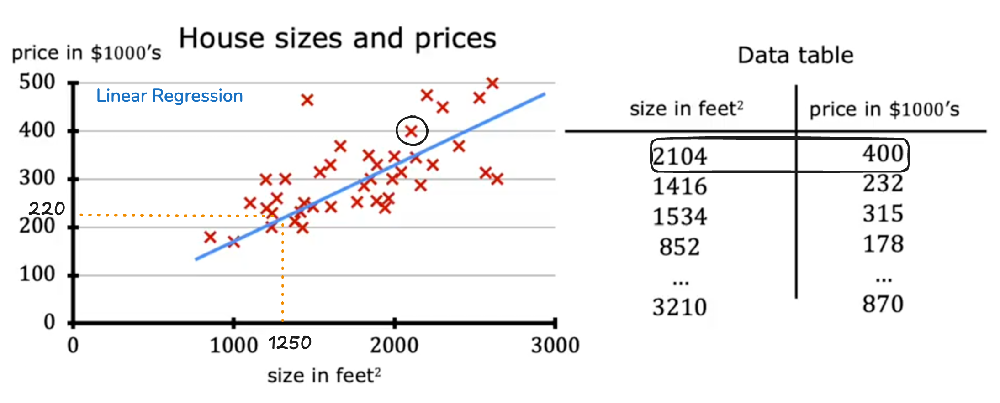

**Practical Application Example**

- **The Scenario:** You are a real estate agent in Portland.
    
- **The Workflow:** You take a new input (a client's 1250 sq. ft. house), find where it intersects the "best fit line" on your model, and trace it to the output axis to provide a price estimate (e.g., $\$220,000$).

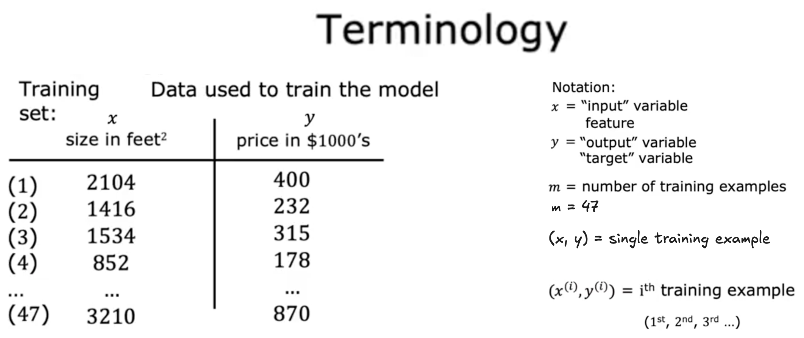

#### Cost Function

- The Cost Function

	- The **Cost Function** is a mathematical formula used to evaluate the model's performance. Its primary role is to measure **how well the model is doing** by calculating the difference between the predicted values and the actual "right answers." 
	- This serves as a guide to help the model "do better" by minimizing errors.

- The Model Equation

	- The linear regression model is expressed as a linear function:

$$f_{w,b}(x) = wx + b$$

- Key Terminology: Parameters

	- The variables $w$ and $b$ are the **parameters** of the model. These are the "knobs" or variables that you adjust during the training process to improve accuracy.

	- **$w$ (Weight):** Also known as a coefficient.
    
	- **$b$ (Bias):** Often referred to alongside $w$ as the parameters of the model.

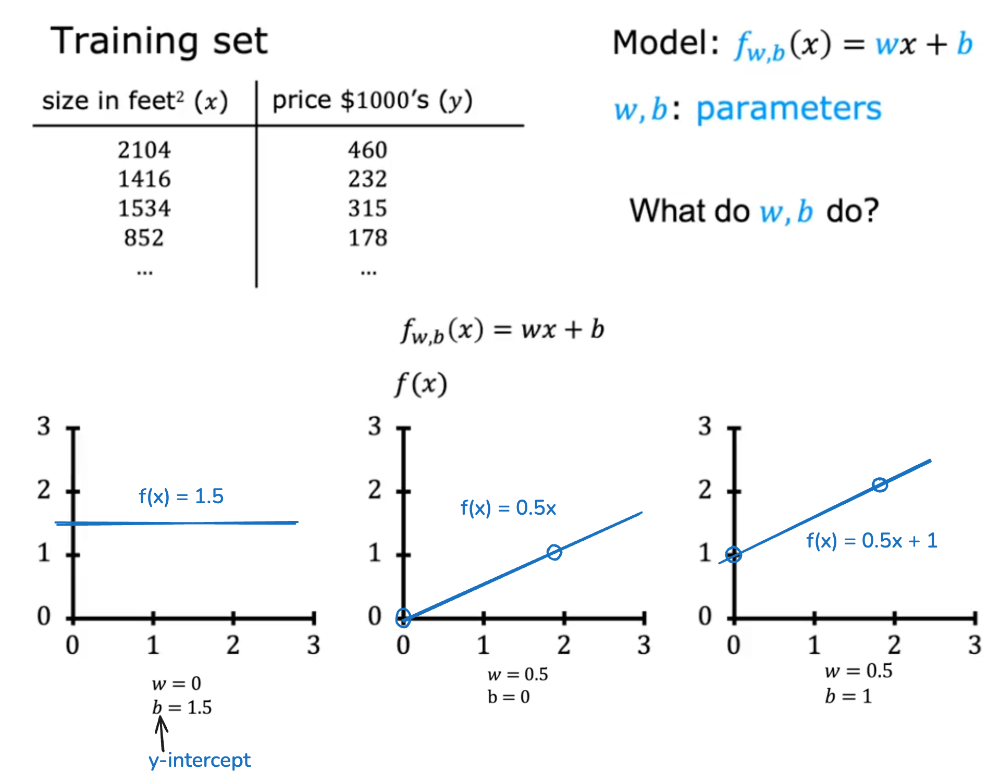

- Key Notation

	- **$x^{(i)}, y^{(i)}$**: The actual data (input and target) for the $i^{th}$ example.
	    
	- **$\hat{y}^{(i)}$ (y-hat)**: The **prediction** made by the model for the $i^{th}$ example ($f_{w,b}(x^{(i)})$).
	    
	- **$m$**: The total number of training examples.

- Defining the Cost Function ($J$) 
	- To measure how "wrong" the model is, we use the **Squared Error Cost Function**, denoted as $J(w, b)$.

	The Formula:

$$J(w, b) = \frac{1}{2m} \sum_{i=1}^{m} (f_{w,b}(x^{(i)}) - y^{(i)})^2$$

	- **Error:** The difference between the prediction and the actual target $(\hat{y} - y)$.
    
	- **Squared Error:** We square the error so that all deviations are positive and larger errors are penalized more heavily.
    
	- **Mean (Average):** We divide by $m$ so the cost doesn't grow simply because we added more data.
    
	- **The $\frac{1}{2}$ Factor:** A convention used to make future calculus (derivatives) cleaner; it does not change the optimal values of $w$ and $b$.

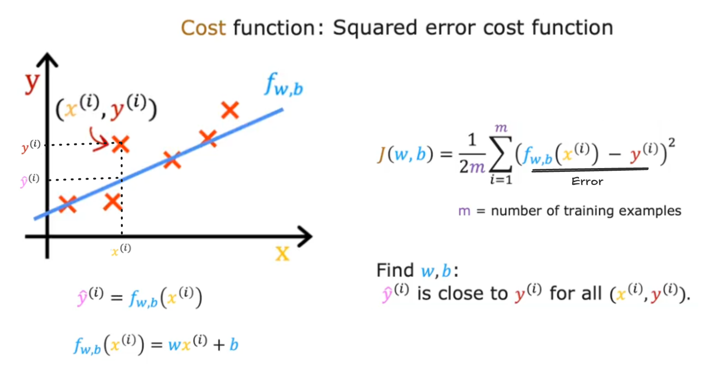

- The Objective

	- The "best" model is the one where the cost $J(w, b)$ is at its **minimum**. 
	- A small $J$ means the predictions are very close to the actual data, while a large $J$ means the line is a poor fit.

#### Cost Function Intuition

- The Simplified Model

	To visualize the concept in 2D, the parameter $b$ is set to $0$.
	
	- **Equation:** $f_w(x) = wx$
	    
	- **Visual:** This forces the line to always pass through the **origin (0,0)**.
	    
	- **Goal:** Find the single value of $w$ that minimizes the cost function $J(w)$.

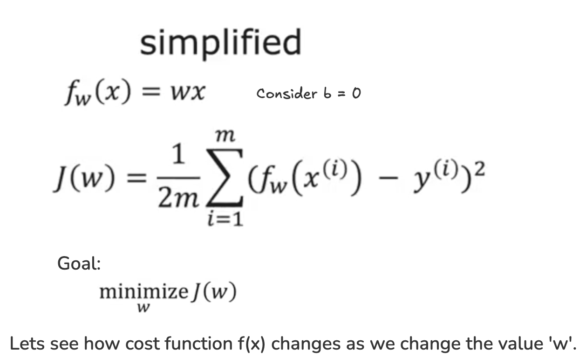

- **Perfect Fit ($w=1$):** The line passes exactly through the points $(1,1), (2,2), (3,3)$. The error is $0$, so $J(1) = 0$. This is the **minimum point** of the curve.
    
- **Poor Fit ($w=0.5$ or $w=0$):** The line is too flat. The gap (error) between the points and the line increases. $J(0.5) \approx 0.58$ and $J(0) \approx 2.33$.
    
- **Negative Slope ($w=-0.5$):** The line points the wrong way entirely, causing a massive error ($J \approx 5.25$).

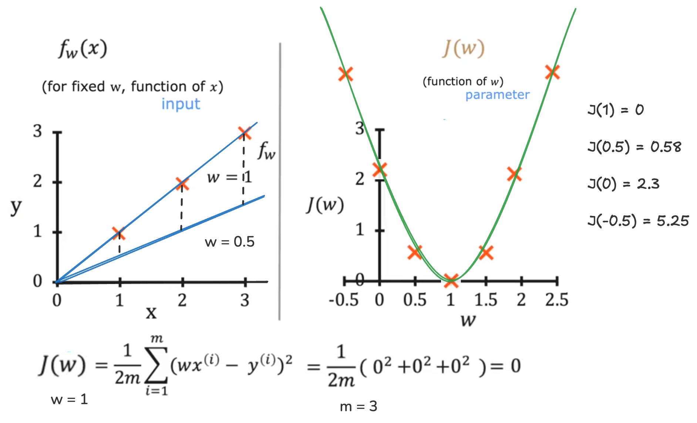

The cost function $J(w)$ for linear regression forms a **bowl-shaped curve** (a parabola). The "best" version of the model is found at the very bottom of that bowl, where the cost is at its lowest possible value. In the example provided, that point is $w=1$.

#### Visualizing the cost function

From a Bowl to a 3D Surface

- When both $w$ and $b$ are variables, the cost function $J(w, b)$ is no longer a simple 2D curve. Instead, it becomes a **3D surface**.

	- **Visual Shape:** It is often described as a **3D soup bowl**, a hammock, or a dinner plate.
	    
	- **The Axes:** The "floor" of the plot consists of the $w$ and $b$ axes, while the **height** of the surface at any given point represents the value of the cost function $J$ for those specific parameters.
	    
	- **The Goal:** Just like the 2D version, we want to find the coordinates $(w, b)$ that correspond to the **lowest point** at the bottom of the bowl.

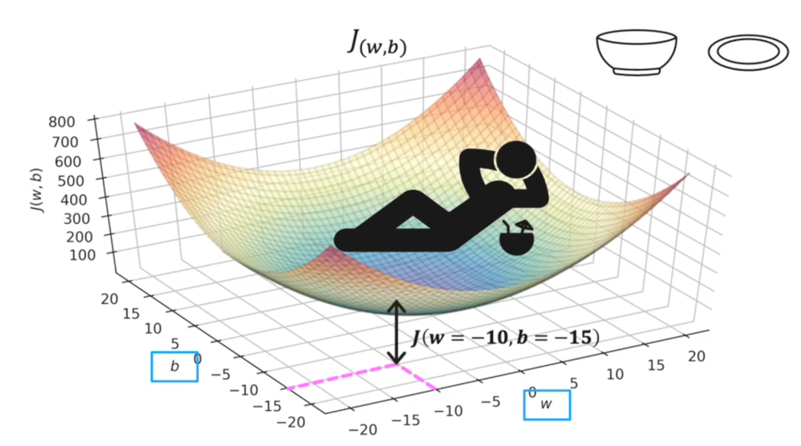

The Contour Plot

- To make the 3D surface easier to read on a 2D screen.

	- **Mechanism:** Imagine taking horizontal slices of the 3D bowl. Each slice creates an oval (ellipse).
	    
	- **Interpretation:**
	    
	    - **Circles/Ovals:** Every point on a single line has the **exact same cost value ($J$)**, even though the $w$ and $b$ values are different.
	        
	    - **The Center:** The smallest, innermost circle represents the **minimum** of the cost function—the "bottom of the bowl."
	        
	    - **The Mapping:** A point far from the center represents a "bad" model (high error), while a point near the center represents a line that fits the data well.

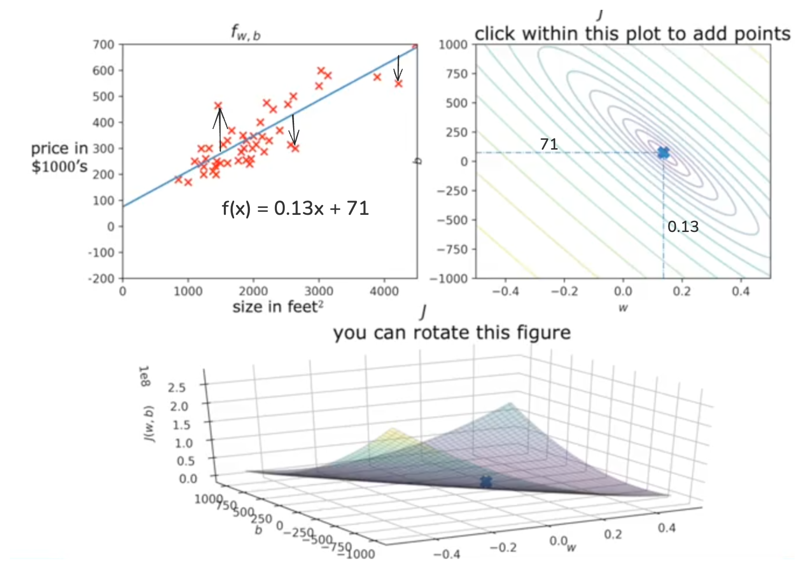

---

### Train the Model with Gradient Descent

#### Gradient Descent

- What is Gradient Descent?

	- **The Purpose:** It is a systematic, automated way to find the values of parameters (like $w$ and $b$) that result in the smallest possible cost $J$.
	    
	- **Versatility:** While we use it for linear regression, it can be applied to any function to find its minimum, even models with hundreds or millions of parameters (2$w_1, w_2, ... w_n$).

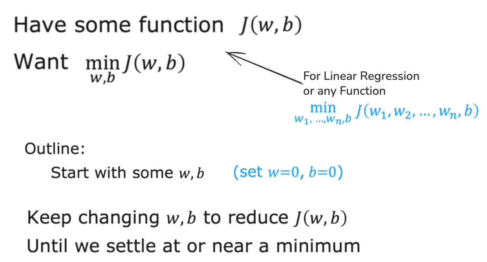

- The "Hill Climbing" (or Downhill) Analogy
	
	- **The Starting Point:** You begin at a random point (commonly by setting $w=0$ and $b=0$).
	    
	- **The Direction:** You look $360^\circ$ around you and determine which direction to take a "baby step" to go **downhill as quickly as possible**. This is mathematically known as the **direction of steepest descent**.
	    
	- **The Iteration:** You repeat this process—stepping, looking around, and stepping again—until you reach the bottom of a valley.

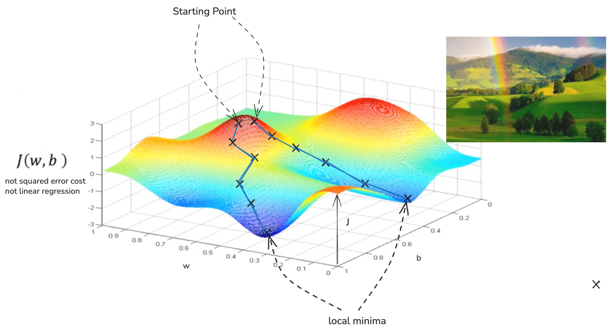

- Local Minima: A Key Property

	- Unlike the "perfect bowl" of linear regression, more complex models (like neural networks) may have many valleys.

		- **Sensitivity to Starting Points:** If you start a few steps to the right or left, you might end up in a completely different valley.
		    
		- **Local Minimum:** Each of these valleys is called a **local minimum**. Once the algorithm settles at the bottom of one valley, it generally cannot "jump out" to find a different, potentially deeper one.

#### Implementing Gradient Descent

- The Gradient Descent Algorithm

	- The update rules for the parameters $w$ and $b$ are defined as:

$$w = w - \alpha \frac{d}{dw} J(w,b)$$

$$b = b - \alpha \frac{d}{db} J(w,b)$$

	**$=$ (Assignment Operator):** In this context, $=$ means "update the value of the variable on the left with the result of the calculation on the right" (similar to `a = a + 1` in programming).

- Key Components of the Equation

	- **$\alpha$ (Learning Rate):** A small positive number (e.g., $0.01$) that controls **how big of a step** you take.
	    
	    - Large $\alpha$: Aggressive, huge steps.
	        
	    - Small $\alpha$: Tiny baby steps.
	        
	- **$\frac{d}{dw}$ and $\frac{d}{db}$ (Derivative Terms):** These terms from calculus tell the algorithm the **direction** of the steepest descent. They determine which way to move to reduce the cost $J$ most quickly.
	    
	- **Convergence:** The algorithm "converges" when you reach a minimum where the values of $w$ and $b$ stop changing significantly with each step.
    

- The "Simultaneous Update" Rule

	- A crucial detail in implementing gradient descent correctly is updating both parameters at the same time using the values from the _previous_ step.
	
	- **Correct Method (Simultaneous):**
		
		1. Calculate the new proposed $w$ and store it in a temporary variable (`temp_w`).
		    
		2. Calculate the new proposed $b$ and store it in a temporary variable (`temp_b`).
		    
		    - _Crucial:_ Both calculations use the **original** $w$ and $b$.
		        
		3. Only after calculating both, update $w$ and $b$ with the values in the temporary variables.

#### Gradient Descent Intuition

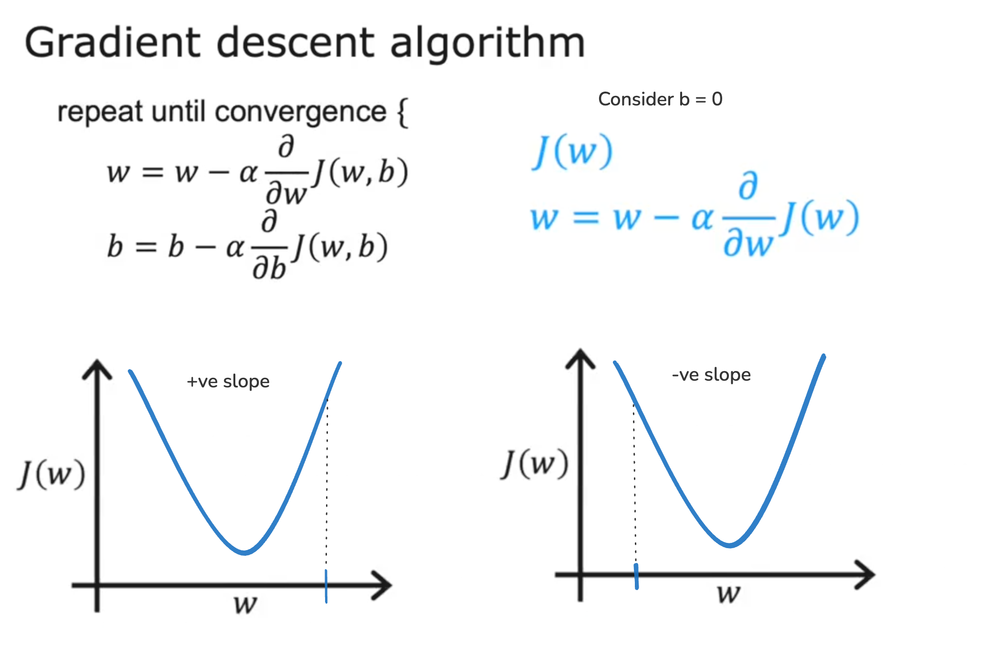

The Derivative as Slope

The derivative ($\frac{d}{dw}$) at any point on the cost function curve can be visualized as the **slope of the tangent line** (a line that just touches the curve at that specific point).

- **Positive Slope:** If the tangent line points **up and to the right**, the derivative is a **positive number**. In calculus, when the output increases as the input increases, the slope is **positive**.
    
    - **The Math:** $w = w - (\text{positive } \alpha) \times (\text{positive derivative})$.
        
    - **The Result:** $w$ decreases (moves to the left). This moves the model toward the minimum at the bottom of the "valley."
        
- **Negative Slope:** If the tangent line points **down and to the right**, the derivative is a **negative number**. In calculus, when the output decreases as the input increases, the slope is **negative**.
    
    - **The Math:** $w = w - (\text{positive } \alpha) \times (\text{negative derivative})$.
        
    - **The Result:** Subtracting a negative is the same as adding ($w + \dots$). Therefore, $w$ increases (moves to the right). This also moves the model toward the minimum.
        
Why the Derivative Works

Regardless of where you start on the curve, the math of the derivative ensures you always move in the correct direction:

- Starting too far to the **right**? The positive slope pushes you **left**.
    
- Starting too far to the **left**? The negative slope pushes you **right**.
    
Key Takeaways

- **Directional Control:** The derivative term's primary job is to tell the algorithm whether to increase or decrease $w$ to lower the cost $J$.
    
- **Simplification:** While experts might call this a "partial derivative" in a multi-parameter model, the core logic remains the same: find the slope and move in the opposite direction.

#### Learning Rate

The Impact of the Learning Rate ($\alpha$)

The choice of $\alpha$ determines the size of the steps the algorithm takes. Selecting an inappropriate value leads to two major problems:

- **$\alpha$ is too small:** The algorithm will function correctly but will be **extremely slow**. It takes minuscule "baby steps" and requires a massive number of iterations to reach the minimum.
    
- **$\alpha$ is too large:** The algorithm may **overshoot** the minimum, jumping from one side of the valley to the other. Instead of settling at the bottom, the cost $J$ can actually increase with each step, causing the algorithm to **diverge** (fail to find a solution).

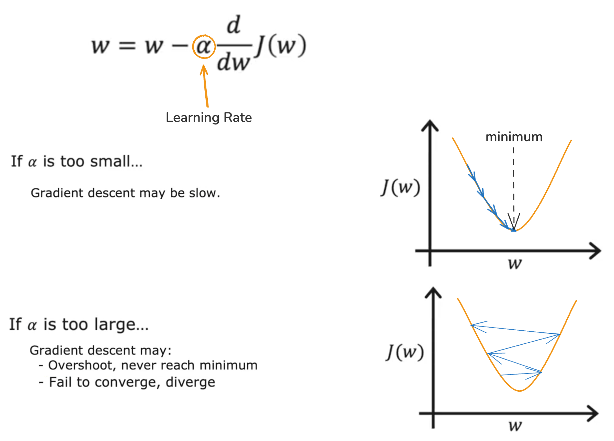

Behavior at the Minimum

A common question is what happens when you actually reach the bottom of the "valley."

- **The Math:** At a local minimum, the tangent line is flat, meaning the **derivative is zero** ($\frac{d}{dw}J(w) = 0$).
    
- **The Update:** The equation becomes $w = w - \alpha(0)$.
    
- **The Result:** $w$ remains unchanged. Once gradient descent reaches a minimum, it stays there automatically, even if you continue to run the algorithm.

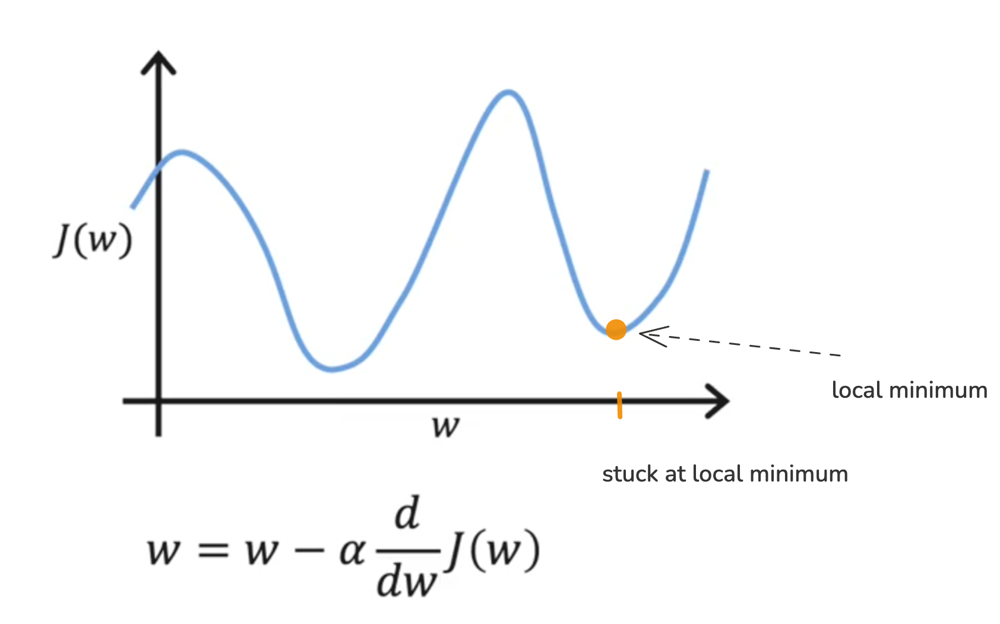

Automatic Step-Size Adjustment

Interestingly, you do not need to change $\alpha$ as you get closer to the minimum. Gradient descent takes **automatically smaller steps** as it approaches the bottom.

1. **Far from minimum:** The slope is steep (large derivative), so the step $(\alpha \times \text{slope})$ is large.
    
2. **Near minimum:** The slope becomes shallower (small derivative), so the step $(\alpha \times \text{slope})$ naturally becomes smaller.

#### Gradient Descent for Linear Regression

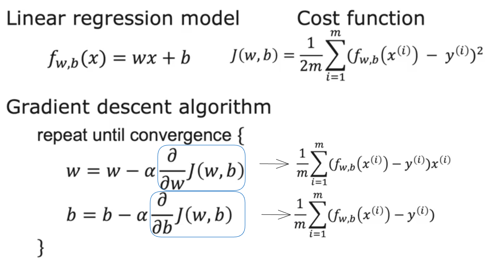

The Gradient Descent Update Formulas

By applying calculus (specifically partial derivatives) to the cost function $J(w, b)$, we get the specific update rules for linear regression.

- For $w$:
    
    $$w = w - \alpha \frac{1}{m} \sum_{i=1}^{m} (f_{w,b}(x^{(i)}) - y^{(i)}) x^{(i)}$$
    
- For $b$:
    
    $$b = b - \alpha \frac{1}{m} \sum_{i=1}^{m} (f_{w,b}(x^{(i)}) - y^{(i)})$$
    

**The Calculus "Trick":** You may have noticed a $\frac{1}{2}$ in the original cost function. This was placed there specifically so that when you take the derivative, the $2$ from the exponent cancels out, leaving the clean formulas shown above.

Global vs. Local Minima

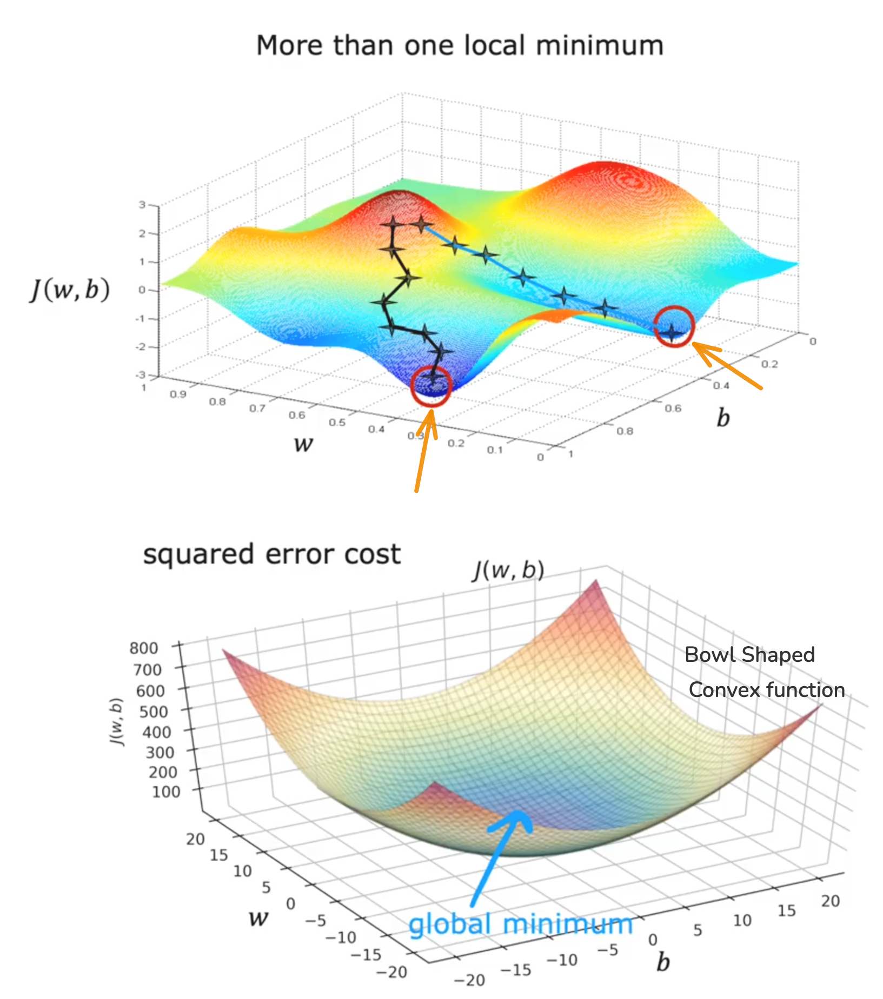

A common concern with gradient descent in complex models (like neural networks) is getting stuck in a "local minimum"—a valley that isn't the absolute lowest point.

- **The Good News for Linear Regression:** Because we use the squared error cost function, the resulting shape is always a **convex function**.
    
- **What is a Convex Function?** It is a "bowl-shaped" function that is guaranteed to have only **one single minimum** (the global minimum).
    
- **The Result:** You don't have to worry about starting in the "wrong" place. As long as your learning rate ($\alpha$) is chosen correctly, gradient descent will always find its way to the absolute best possible $w$ and $b$.
    
#### Running Gradient Descent

The Algorithm in Action

- **Initialization:** While $w$ and $b$ are often started at $0$, the example starts with a poor fit ($w = -0.1$, $b = 900$).
    
- **The Trajectory:** As gradient descent runs, you can watch the parameters "walk" across the **contour plot** toward the center.
    
- **Simultaneous Improvement:** On the data plot, the straight line rotates and shifts with every step, getting closer to the actual data points until it reaches the **global minimum**.
    
- **Outcome:** Once at the minimum, you have a finalized model $f(x)$ that can predict values for new inputs (e.g., estimating a 1250 sq. ft. house at $\$250,000$).

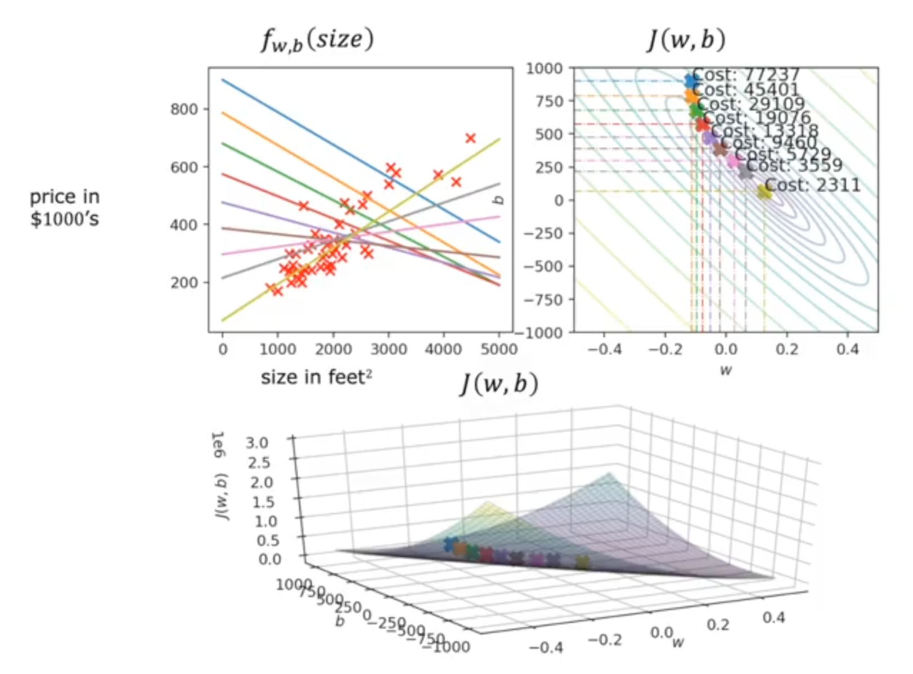

What is "Batch" Gradient Descent?

The specific version of gradient descent covered here is called **Batch Gradient Descent**.

- **Definition:** On every single update step, the algorithm looks at **all** $m$ training examples.
    
- **The Calculation:** The "batch" refers to the entire set of data used to calculate the summation ($\sum_{i=1}^{m}$) in the derivative terms.
    
- **Alternative Versions:** While other versions exist that look at only small subsets of data (to save computing power on massive datasets), Batch Gradient Descent is the standard approach for basic linear regression.
    

