# Regression with Multiple Input Variables

**Learning Objectives**
- Use vectorization to implement multiple linear regression
- Use feature scaling, feature engineering, and polynomial regression to improve model training
- Implement linear regression in code

### Multiple Linear Regression

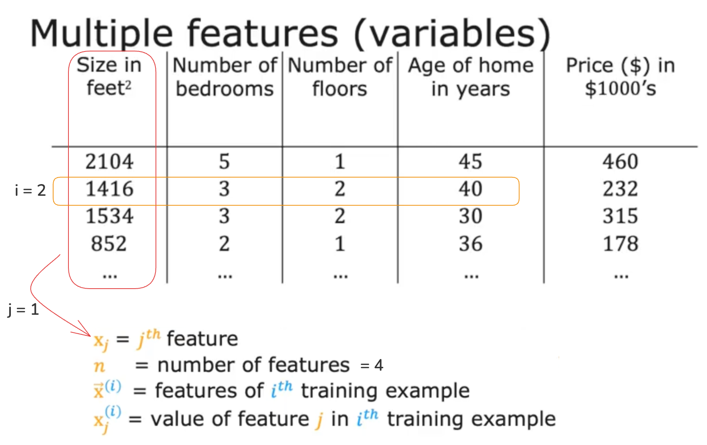

**New Features and Notation**

Instead of relying solely on one feature (e.g., house size), the model can now incorporate various data points such as the number of bedrooms, number of floors, and the age of the home.

- **$n$**: Represents the total number of features (in this example, $n = 4$).
    
- **$x_j$**: Denotes the $j^{th}$ feature.
    
- **$\vec{x}^{(i)}$**: Represents the $i^{th}$ training example as a **vector** (a list of all feature values for that specific example).
    
- **$x^{(i)}_j$**: Denotes the value of the $j^{th}$ feature in the $i^{th}$ training example.
    

**The Multiple Linear Regression Model**

The model is expanded to assign a unique weight ($w$) to each individual feature:

$$f_{w,b}(x) = w_1x_1 + w_2x_2 + w_3x_3 + w_4x_4 + b$$

**Interpreting the Parameters:**

- **$b$**: The base price (e.g., the value of a house with no size, age, or rooms).
    
- **$w_j$**: The change in the predicted price for every unit increase in feature $x_j$. For instance, a weight of $-2$ for "house age" suggests the price decreases by $\$2,000$ for every additional year.

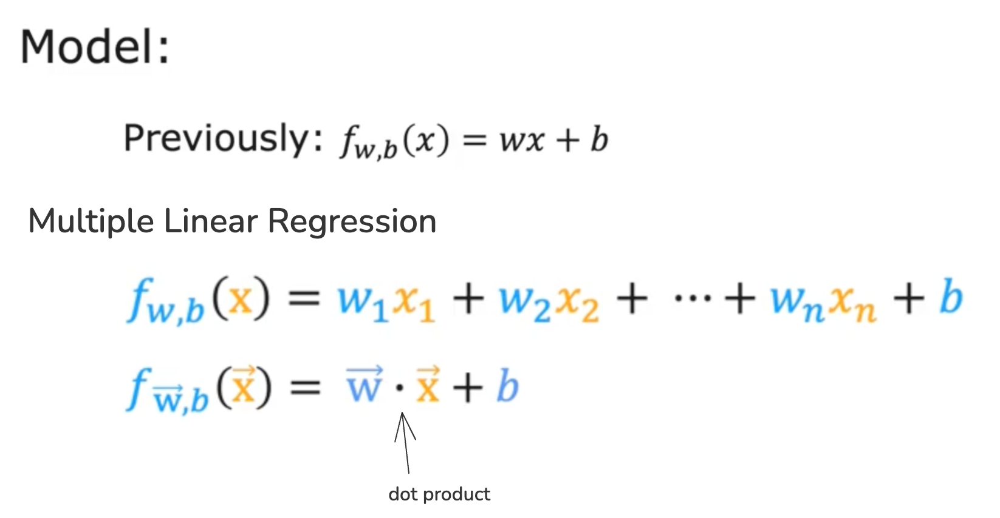

**Vectorization and the Dot Product**

To simplify the mathematical notation and improve implementation efficiency, the parameters and features are grouped into vectors:

- **$\vec{w}$**: A vector containing all weights $[w_1, w_2, ..., w_n]$.
    
- **$\vec{x}$**: A vector containing all features $[x_1, x_2, ..., x_n]$.
    

The model can be rewritten succinctly using a dot product:

$$f_{\vec{w},b}(\vec{x}) = \vec{w} \cdot \vec{x} + b$$

The dot product is calculated by multiplying corresponding pairs of numbers ($w_1x_1, w_2x_2$, etc.) and summing them up.

#### Vectorization

**Python and NumPy Indexing**

- **NumPy** is the most widely used numerical linear algebra library in Python and machine learning.
    
- Python uses **0-based indexing**, meaning counting starts at 0 rather than 1.
    
- To access the first three elements of a parameter vector $w$, you would use `w[0]`, `w[1]`, and `w[2]`.
    
- Individual features of $x$ are accessed similarly using `x[0]`, `x[1]`, and `x[2]`.
    
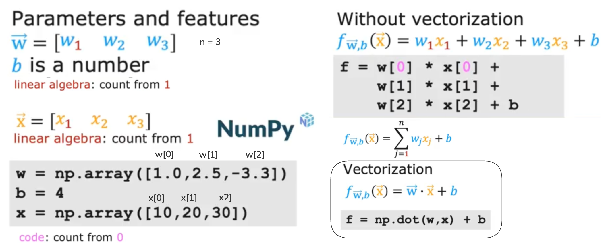

**The Power of Vectorization**

Vectorization offers two distinct advantages for machine learning:

- **Shorter Code:** The entire dot product operation is reduced to a single line of code.
    
- **Faster Execution:** It runs much faster than a loop because it uses **parallel hardware**.
    
- **Hardware Acceleration:** Behind the scenes, NumPy's `dot` function utilizes parallel processing on either a **CPU** or a **GPU** (Graphics Processing Unit).
    
- **Scalability:** While for loops compute each multiplication one after another, vectorized code can compute multiple multiplications at the same time, making it essential when the number of features ($n$) is large.

Vectorization is a powerful technique in machine learning that allows algorithms to run significantly faster by utilizing a computer's parallel processing hardware.

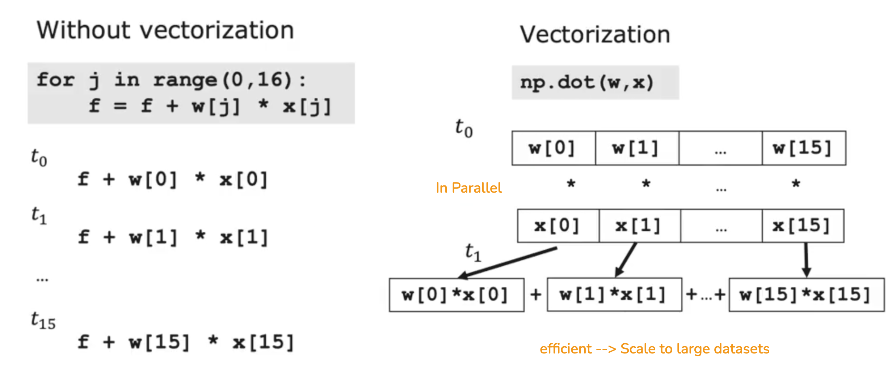

**Sequential vs. Parallel Processing**

The core difference between unvectorized and vectorized code lies in how the computer handles time-steps:

- **Unvectorized (Sequential):** A standard `for loop` performs operations one after another. For example, if you have 16 indices, the computer calculates the value for index 0 at time $t_0$, index 1 at $t_1$, and so on until the 16th step.
    
- **Vectorized (Parallel):** In a vectorized implementation (like using NumPy), the computer uses specialized hardware to multiply and add all pairs of values in a single step. Instead of distinct, sequential additions, it processes all values simultaneously in parallel.

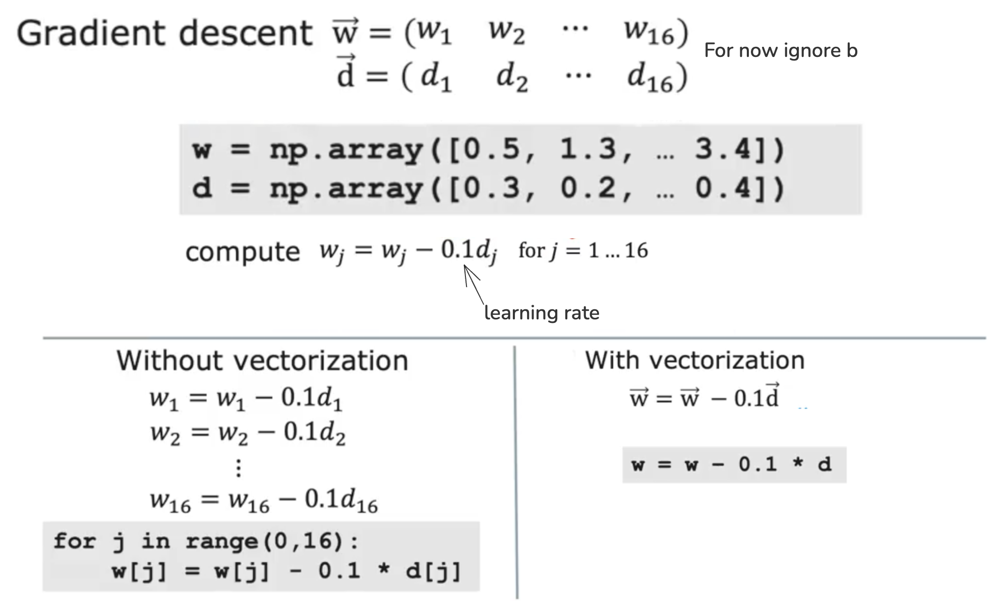

**Concrete Example: Parameter Updates**

When training a model with 16 features, you must update 16 parameters ($w_1$ through $w_{16}$).

- **Without Vectorization:** You would write a loop to update each weight individually ($w_j = w_j - 0.1 \times d_j$) over 16 time-steps.
    
- **With Vectorization:** You can write a single line of code: `w = w - 0.1 * d`. The computer takes the NumPy arrays and carries out all 16 computations in one efficient, parallel step.
    
Impact on Scalability

While the speed difference might be minor for 16 features, vectorization is essential for modern machine learning involving large datasets and thousands of features.

- **Efficiency:** It can reduce the running time of an algorithm from many hours down to just one or two minutes.
    
- **Scale:** Vectorization is a key step in allowing learning algorithms to scale to the massive datasets required for advanced models.
    
#### Gradient Descent for Multiple Linear Regression

**Vectorized Multiple Linear Regression**

To manage multiple features efficiently, the model parameters and input data are treated as vectors:

- **Vector Notation**: The parameters $w_1$ through $w_n$ are collected into a vector $\vec{w}$, and the features into a vector $\vec{x}$.
    
- **The Model**: The model is written succinctly as $f_{\vec{w},b}(\vec{x}) = \vec{w} \cdot \vec{x} + b$, where the dot product handles the sum of all weighted features.
    
- **Cost Function**: The cost function $J(\vec{w}, b)$ now takes a vector $\vec{w}$ and a scalar $b$ as inputs to return the total error.

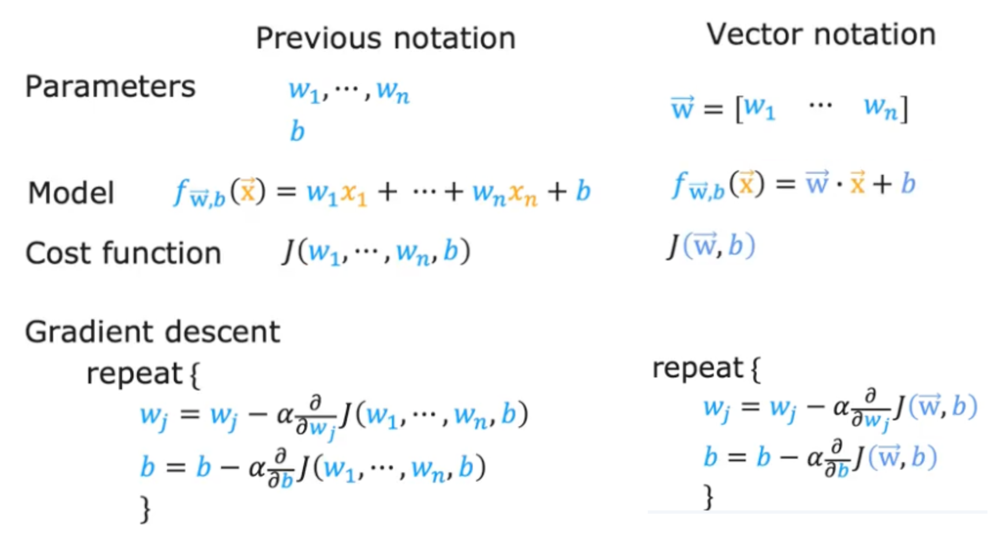

Gradient Descent for Multiple Features

The gradient descent algorithm must update every parameter $w_j$ simultaneously.

- Update Rule: For each feature $j$ (from 1 to $n$), the parameter $w_j$ is updated using:
    
    $w_j = w_j - \alpha \frac{\partial}{\partial w_j} J(\vec{w}, b)$.
    
- **The Derivative**: The formula for the derivative of $J$ with respect to $w_j$ is similar to the single-feature case, but it uses the specific feature $x_j^{(i)}$ corresponding to that weight.
    
- **Simultaneity**: Just as with univariate regression, all $w_j$ parameters and $b$ must be updated at the same time in each iteration.

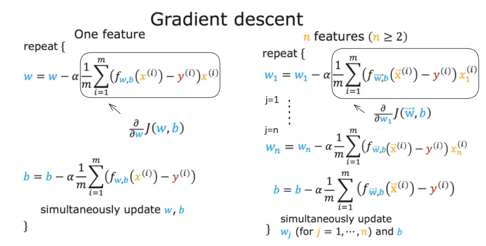

**The Normal Equation**

The "Normal Equation" is a mathematical method that solves for the optimal $w$ and $b$ in a single step without using iterations like gradient descent.

- **Advantages**: It does not require an iterative process or a learning rate $\alpha$.
    
- **Disadvantages**:
    
    - **Poor Scaling**: It becomes very slow as the number of features $n$ becomes large.
        
    - **Limited Scope**: It only works for linear regression and does not generalize to other algorithms like logistic regression or neural networks.
        
- **Usage**: While it may be used "under the hood" in some machine learning libraries, gradient descent remains the preferred method for most learning tasks.

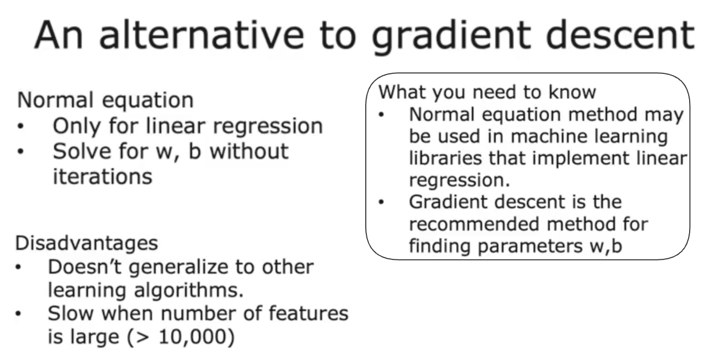

---

### Gradient Descent in Practice

#### Feature Scaling

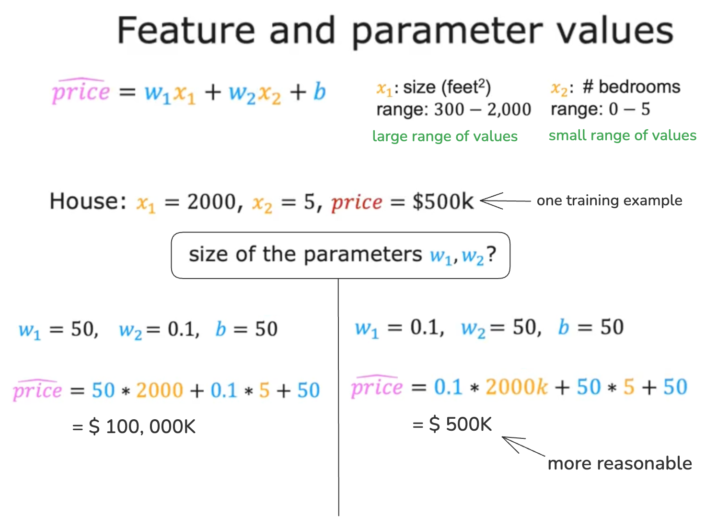

**Feature Range vs. Parameter Size**

The size of a feature has an inverse relationship with the size of its optimal parameter:

- **Large Feature Ranges:** If a feature like "house size" ($x_1$) ranges from 300 to 2,000, its parameter ($w_1$) will likely be relatively **small** (e.g., 0.1).
    
- **Small Feature Ranges:** If a feature like "number of bedrooms" ($x_2$) ranges from 0 to 5, its parameter ($w_2$) will likely be relatively **large** (e.g., 50).
    
- **Reasoning:** Because $w_1$ is multiplied by a large number, a tiny change in $w_1$ significantly impacts the predicted price and the cost function.

**Impact on the Cost Function**

When features have drastically different scales, the cost function's contour plot becomes distorted:

- **Tall and Skinny Ellipses:** The contours look like long, thin ovals.
    
- **Gradient Descent Inefficiency:** Because the "bowl" is so uneven, gradient descent tends to **bounce back and forth** for a long time. This creates an indirect, zigzagging path that makes reaching the global minimum very slow.

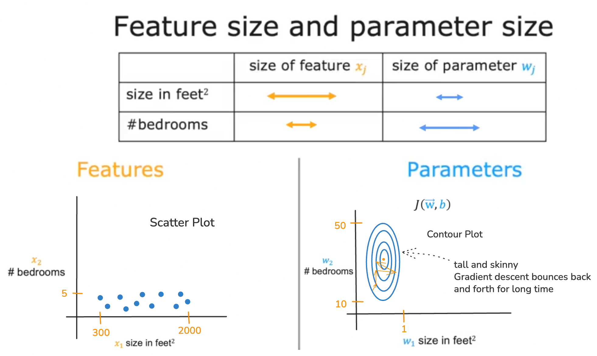

**The Solution: Scaling Features**

Scaling involves transforming the training data so that all features take on a **comparable range of values** (e.g., both $x_1$ and $x_2$ ranging from 0 to 1):

- **Circular Contours:** After scaling, the cost function contours look more like **circles**.
    
- **Direct Path:** Gradient descent can find a much more **direct path** to the global minimum, significantly increasing its speed and efficiency.

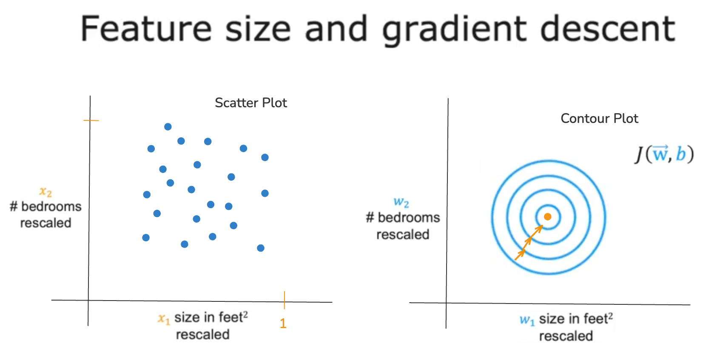

Feature scaling is a preprocessing technique used to bring features with different ranges into a comparable scale, which significantly speeds up the convergence of gradient descent.

#### Scaling Methods

There are three primary ways to implement feature scaling:

**Division by Maximum:** Divide each feature value by the maximum value in its range. For example, if house sizes range from 3 to 2,000, dividing by 2,000 results in a scaled range of 0.15 to 1.

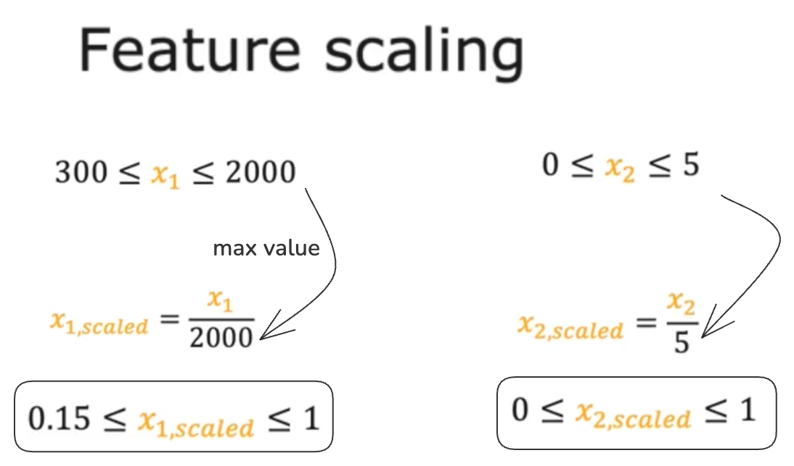

**Mean Normalization:** This method centers the features around zero, resulting in both positive and negative values (typically between -1 and +1).

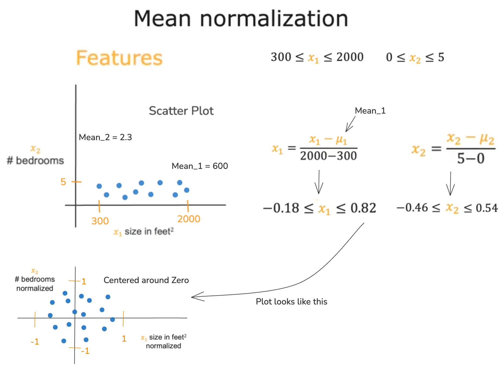

**Z-score Normalization:** This utilizes the standard deviation and the mean to normalize the data.

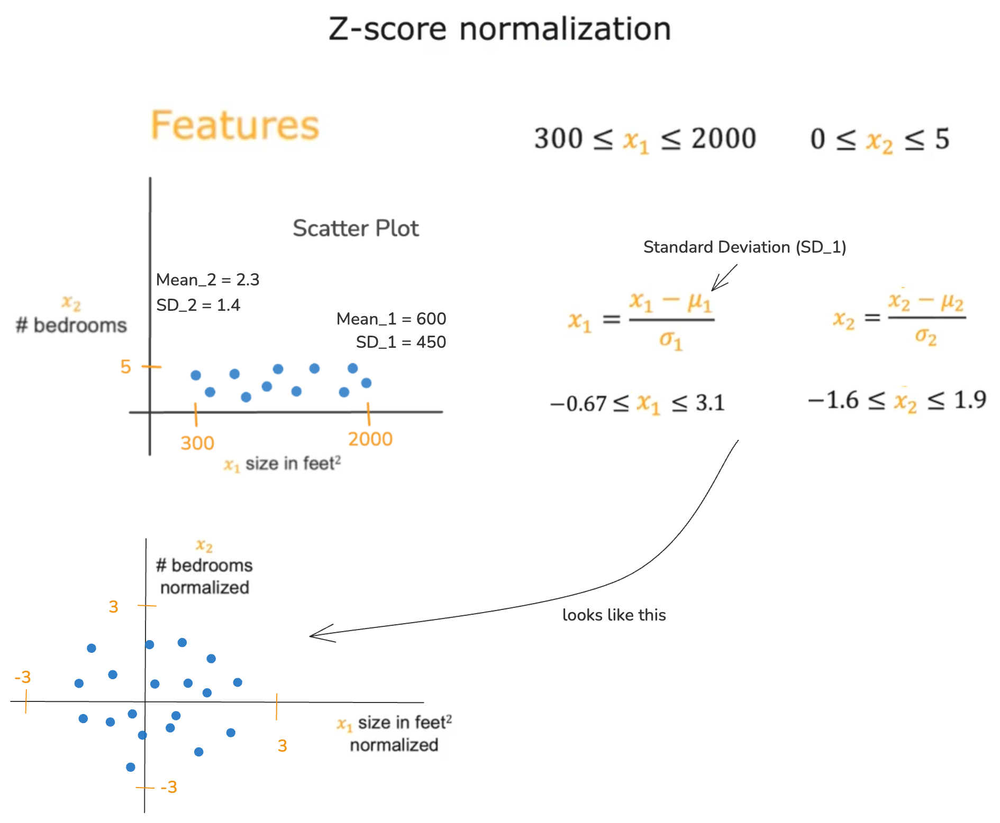

**General Rules for Scaling**

While the goal is to get features into a range near -1 to +1, these limits are flexible.

* **Acceptable Ranges:** Features ranging from -3 to +3 or -0.3 to +0.3 are generally acceptable without further scaling.
* **When to Scale:**
	* If a feature is too large (e.g., -100 to +100), it should be scaled down.
	* If a feature is too small (e.g., -0.001 to +0.001), it should be scaled up.
	* Even if values are close together but far from zero (e.g., body temperatures from 98.6 to 105), scaling is beneficial because the absolute values are large compared to other scaled features.

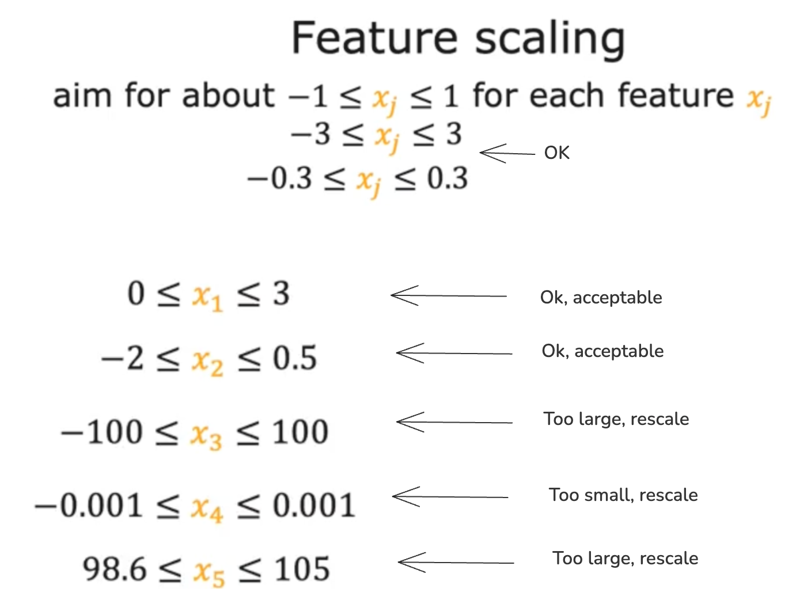

**Practical Advice**

There is "almost never any harm" in performing feature scaling. When in doubt, it is highly encouraged to carry it out to ensure gradient descent runs efficiently.

#### Checking Gradient Descent for Convergence

**The Learning Curve**

To visualize convergence, you should plot a **learning curve**. Unlike previous graphs that plotted cost vs. parameters, this graph plots:

- **Vertical Axis:** Cost $J(\vec{w},b)$ (the error).
    
- **Horizontal Axis:** Number of iterations (how many steps the algorithm has taken).
    

**What to look for:**

- **Steady Decrease:** If gradient descent is working correctly, the cost $J$ should **decrease after every single iteration**.
    
- **Errors:** If $J$ ever increases, it usually means your learning rate $\alpha$ is too large or there is a bug in your code.
    
- **Flattening Out:** When the curve stays flat and no longer decreases significantly, the algorithm has **converged**. You have found parameters $w$ and $b$ that are at or very near the global minimum.

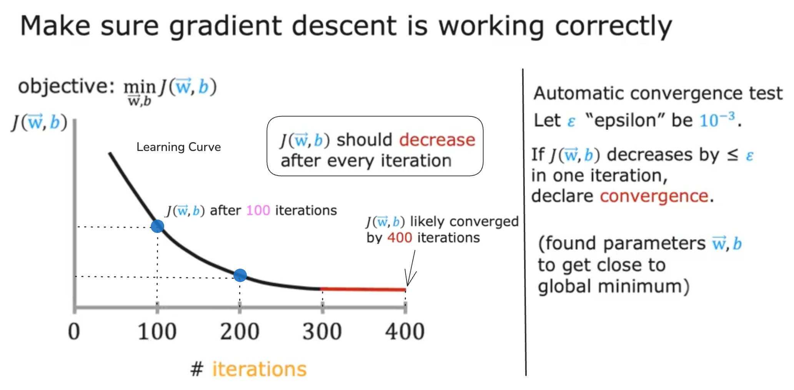

**Identifying Convergence**

Because different problems take a different number of steps to converge (e.g., 30 iterations vs. 100,000), you can use two methods to decide when to stop:

- **Visual Inspection:** Look at the learning curve. If it looks flat after a certain point, you can stop.
    
- **Automatic Convergence Test:** You can set a tiny threshold called **epsilon ($\epsilon$)**, such as $0.001$. If the cost $J$ decreases by less than $\epsilon$ in one step, you declare convergence and stop the algorithm.
    

> **Note:** Andrew Ng recommends visual inspection over automatic tests because choosing the "right" epsilon can be difficult, and the graph provides better insight into whether the algorithm is failing or just slow.

#### Choosing the Learning Rate

Choosing an effective **Learning Rate ($\alpha$)** is critical for both the speed and the success of your model's training. 

**Identifying a Poor Learning Rate**

You can diagnose issues by looking at the **Learning Curve** (Cost $J$ vs. Iterations):

- **Cost Bounces Up and Down:** If the cost decreases then increases intermittently, your learning rate is likely **too large**, causing the algorithm to overshoot the minimum. It could also indicate a bug in the code.
    
- **Cost Consistently Increases:** This usually means $\alpha$ is too large, or you have a **bug in your update rule**. Specifically, check if you accidentally used a plus sign instead of a minus sign ($w = w + \alpha \dots$ instead of $w = w - \alpha \dots$).
    
- **Cost Decreases Extremely Slowly:** This is a sign that your learning rate is **too small**. While it will eventually converge, it is computationally inefficient.
    

> **Debugging Tip:** If gradient descent isn't working, try setting $\alpha$ to a very small number (e.g., $10^{-7}$). If the cost _still_ doesn't decrease consistently, there is almost certainly a bug in your code.
> 

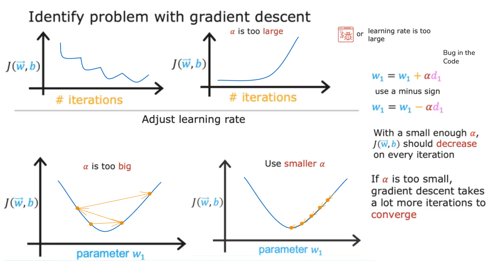

**How to Choose $\alpha$ Systematically**

Instead of guessing randomly, Andrew Ng recommends trying a range of values, increasing each attempt by roughly **3 times** the previous value:

1. **Start Small:** Try $0.001$.
    
2. **Step Up:** If that is too slow, try $0.003$, then $0.01, 0.03, 0.1, 0.3, 1,$ etc.
    
3. **Find the Limits:** Continue until you find a value that is clearly **too large** (cost stops decreasing or increases) and a value that is clearly **too small** (convergence is too slow).
    
4. **Select the "Sweet Spot":** Pick the largest value (or something slightly smaller than it) that still results in a rapid and consistent decrease in cost.

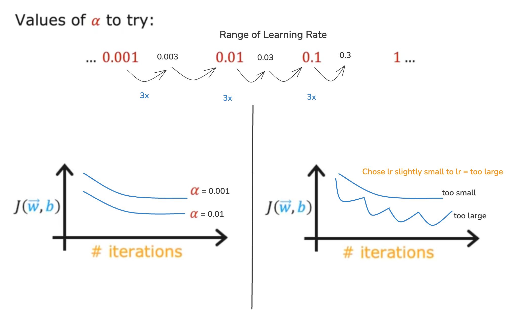

**Summary of Trade-offs**

|**Learning Rate (α)**|**Result**|
|---|---|
|**Too Small**|Reliable convergence, but takes a massive number of iterations (slow).|
|**Too Large**|Fast steps, but may overshoot, diverge, or fail to converge.|
|**Just Right**|The cost decreases rapidly and levels off consistently.|

#### Feature Engineering

Feature engineering is the act of transforming or combining original features into new ones. Instead of just using the raw data as it is, you create features that more accurately represent the underlying patterns of the problem.

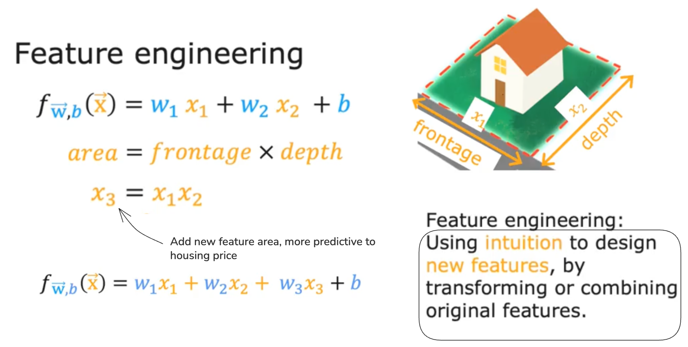

**Concrete Example: House Price Prediction**

Imagine you are given two features for a house:

- **$x_1$:** The frontage (width) of the lot.
    
- **$x_2$:** The depth of the lot.
    

A standard model would look like this:

$$f_{w,b}(x) = w_1x_1 + w_2x_2 + b$$

However, your intuition might tell you that the **total area** of the land is a much stronger indicator of price than the width or depth individually. You can engineer a third feature:

- **$x_3 = x_1 \times x_2$** (Area)
    

Your new, more powerful model becomes:

$$f_{w,b}(x) = w_1x_1 + w_2x_2 + w_3x_3 + b$$

**Why It Matters?**

- **Better Insights:** By providing the model with $x_3$ (area), you allow the algorithm to "decide" which is more important: the frontage, the depth, or the total square footage.
    
- **Accuracy:** Often, the engineered feature simplifies the relationship between the inputs and the output, leading to higher accuracy.

#### Polynomial Regression

This section introduces **Polynomial Regression**, an application of feature engineering that allows linear regression to fit complex, curving data patterns rather than just straight lines.

**Beyond Straight Lines**

Sometimes a straight line doesn't fit the data well. By transforming your original feature $x$ (e.g., house size) into different powers, you can change the shape of your prediction model:

- **Quadratic Function ($x^2$):** Fits a parabolic curve. However, this might be a poor choice for housing if the curve eventually turns downward, as we expect larger houses to cost more.
    
- **Cubic Function ($x^3$):** Fits a curve that can flatten out or turn back upward, potentially matching the data more accurately.
    
- **Square Root Function ($\sqrt{x}$):** Creates a curve that grows but slows down over time, which might model how the "added value" of square footage diminishes for extremely large mansions.

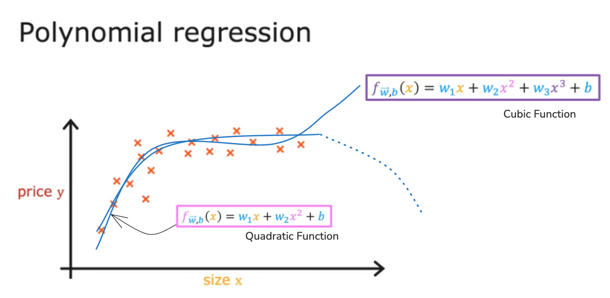

Feature Engineering as Multiple Linear Regression

The "secret" to polynomial regression is that it uses the same machinery as multiple linear regression. You simply treat $x, x^2,$ and $x^3$ as three **separate** features:

- $x_1 = \text{size}$
    
- $x_2 = (\text{size})^2$
    
- $x_3 = (\text{size})^3$
    
The model remains mathematically "linear" with respect to the weights $w$, even though the resulting line on the graph is curved.

**The Necessity of Feature Scaling**

When you use powers of $x$, the ranges of your features explode:

- If $x$ is $10^3$ ($1,000$), then $x^2$ is $10^6$ ($1,000,000$), and $x^3$ is $10^9$ ($1,000,000,000$).
    
Because these ranges are so drastically different, feature scaling is absolutely essential to help gradient descent converge efficiently.
    
**Professional Tools: Scikit-learn**

While implementing these algorithms from scratch is vital for understanding, professional machine learning practitioners often use established libraries like **Scikit-learn**. This toolkit allows you to implement complex models, including linear and polynomial regression, in just a few lines of highly optimized code.

