# Classification

**Learning Objective**

- Use logistic regression for binary classification
- Implement logistic regression for binary classification
- Address overfitting using regularization, to improve model performance

### Classification with Logistic Regression

**What is Binary Classification?**

In many real-world problems, the output $y$ can only be one of two values:

- **Examples:** Spam vs. Not Spam, Fraudulent vs. Legitimate, Malignant vs. Benign.
    
- **Terminology:** This is called **Binary Classification**.
    
- **Notation:** By convention, we use **0** and **1** to represent the two classes.
    
    - **0 (Negative Class):** Represents the absence of something (e.g., not spam, benign).
        
    - **1 (Positive Class):** Represents the presence of what you are looking for (e.g., spam, malignant).
        
    - _Note:_ "Positive" and "Negative" do not imply "good" or "bad"; they are simply mathematical labels.

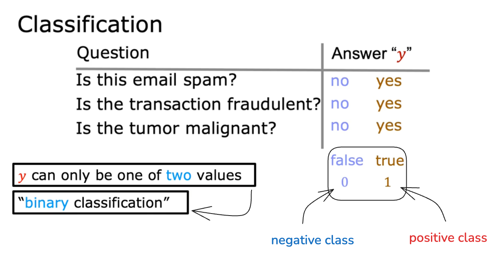

**Why Linear Regression Fails at Classification**

It is tempting to try to use a straight line (Linear Regression) to solve these problems by setting a threshold (e.g., if $f(x) \geq 0.5$, predict $1$). However, this fails for two main reasons:

- **Sensitivity to Outliers:** If you add a single data point very far to the right, the best-fit line shifts significantly. This moves your "decision boundary," causing the model to misclassify points it previously got right—even though the new data point actually confirmed the original pattern.
    
- **Range Issues:** Linear regression can predict values like $1.5$ or $-0.3$, which don't make sense when you are looking for a simple "Yes" or "No" (0 or 1).

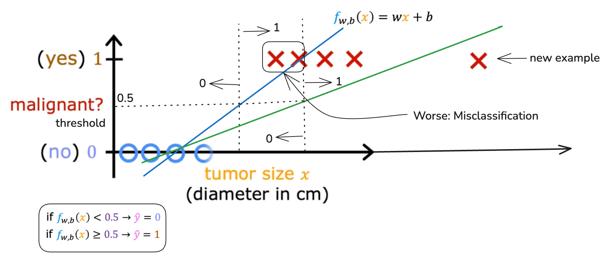

**Introducing Logistic Regression**

To solve these issues, we use **Logistic Regression**.

- **The Name:** Despite having "Regression" in the name (for historical reasons), it is a **Classification** algorithm.
    
- **The Benefit:** It outputs a value that is **always between 0 and 1**, which can be interpreted as the _probability_ that a data point belongs to the positive class.
    
- **Stability:** It is much more robust to outliers and doesn't suffer from the shifting decision boundary issues seen in linear regression.
    
#### Logistic Regression

**The Sigmoid Function (The Logistic Function)**

To ensure the model's output always stays between 0 and 1, logistic regression uses a specific mathematical curve called the **Sigmoid Function**.

- **The Formula:** $g(z) = \frac{1}{1 + e^{-z}}$
    
- **Behavior of $z$:**
    
    - If $z$ is a **large positive number**, $g(z)$ becomes very close to **1**.
        
    - If $z$ is a **large negative number**, $g(z)$ becomes very close to **0**.
        
    - If $z = 0$, $g(z) = 0.5$ (the exact middle point).

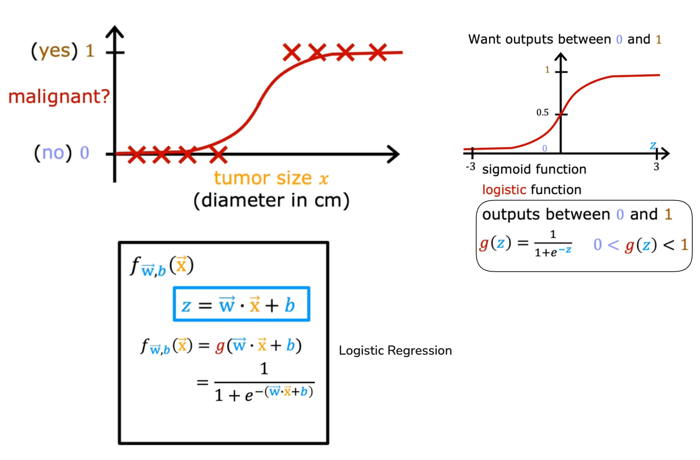

**The Logistic Regression Model**

Building the model happens in two distinct steps:

1. **Linear Step:** Compute a value $z$ using the familiar linear formula: $z = \vec{w} \cdot \vec{x} + b$.
    
2. **Logistic Step:** Map $z$ to a value between 0 and 1 by passing it through the Sigmoid function.
    

**The final model is:** $f_{\vec{w},b}(\vec{x}) = g(\vec{w} \cdot \vec{x} + b) = \frac{1}{1 + e^{-(\vec{w} \cdot \vec{x} + b)}}$

**Interpreting the Output as Probability**

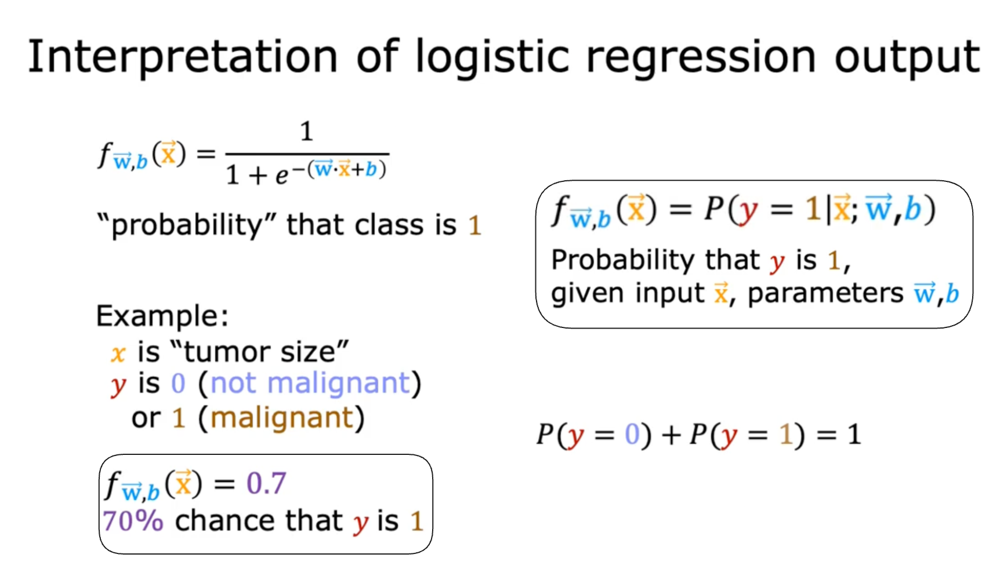

The output $f(\vec{x})$ is interpreted as the **probability** that the label $y$ is 1.

- **Example:** If the model outputs **0.7** for a tumor, it means there is a **70% chance** the tumor is malignant ($y=1$) and a **30% chance** it is benign ($y=0$).
    
- **Sum of Probabilities:** Because $y$ must be either 0 or 1, the probabilities of both outcomes must always add up to 100% (or 1).

**Fun Fact**

For many years, the algorithms that decided which advertisements to show you on major websites were essentially variations of logistic regression. It is an incredibly lucrative and efficient tool in the tech industry.

#### Decision Boundary

**The Threshold for Prediction**

While $f(x)$ outputs a probability, we often need a definitive answer: is the tumor malignant or not? To do this, we set a **threshold**, typically **0.5**:

- **Predict $y=1$** if $f(x) \geq 0.5$
    
- **Predict $y=0$** if $f(x) < 0.5$
    

Mathematically, since $f(x) = g(z)$, and the Sigmoid function $g(z)$ is $\geq 0.5$ only when $z \geq 0$, the rule simplifies to:

- Predict $1$ if $\vec{w} \cdot \vec{x} + b \geq 0$
    
- Predict $0$ if $\vec{w} \cdot \vec{x} + b < 0$

Linear Decision Boundaries

The **Decision Boundary** is the line where $z=0$ (meaning the model is exactly 50/50 neutral).

- In a 2-feature system ($x_1, x_2$), if parameters are $w_1=1, w_2=1, b=-3$, the boundary is the line $x_1 + x_2 - 3 = 0$.
    
- This line separates the "Predict 1" region from the "Predict 0" region.

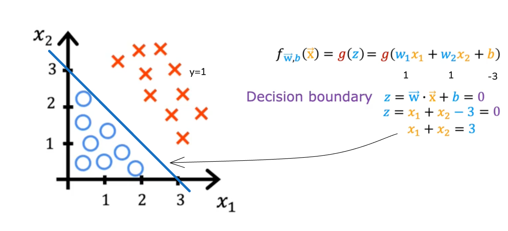

Non-linear Decision Boundaries

Just like in linear regression, we can use **polynomial features** (like $x_1^2$ or $x_1x_2$) to create complex boundaries.

- **Circular Boundaries:** If $z = x_1^2 + x_2^2 - 1$, the boundary is a circle ($x_1^2 + x_2^2 = 1$). The model predicts $1$ for anything outside the circle and $0$ for anything inside.
    
- **Complex Shapes:** By adding higher-order polynomials ($x^3, x^4$, etc.), the decision boundary can become highly irregular shapes to fit more complex data patterns.

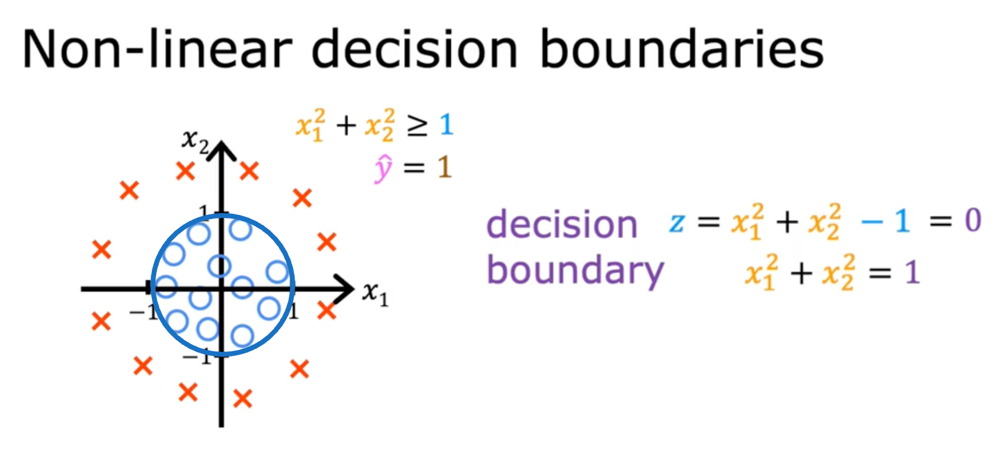

---

### Cost Function for Logistic Regression

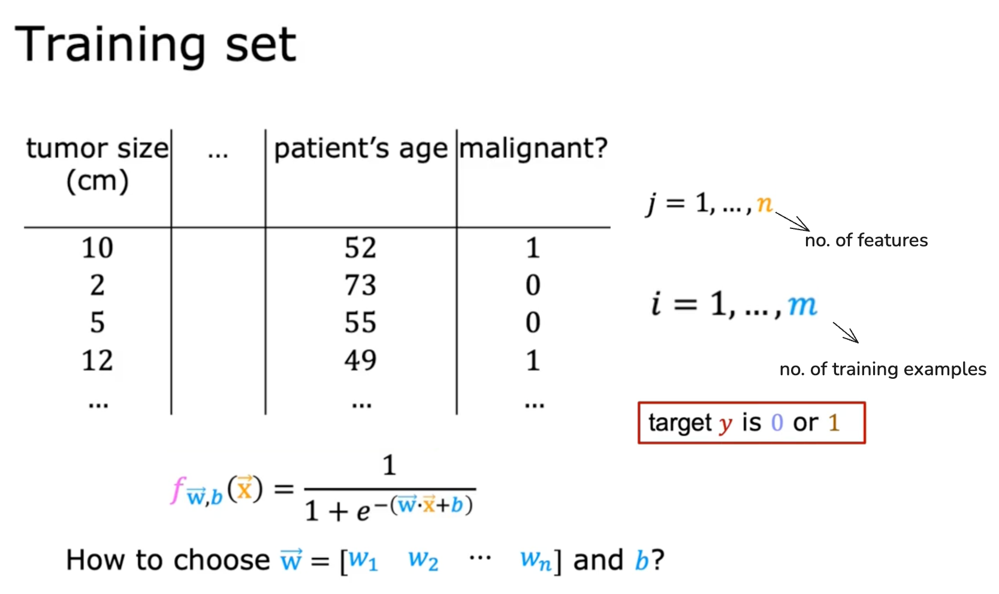

**The Problem with Squared Error**

In linear regression, the squared error cost function is **convex** (bowl-shaped), making it easy for gradient descent to find the global minimum. However, when applied to logistic regression (where $f(x)$ is the S-shaped sigmoid function), the cost function becomes **non-convex**.

- **Non-convexity:** The cost surface becomes "wiggly" with many local minima.
    
- **Risk:** Gradient descent can get stuck in a local minimum, failing to find the best possible parameters.

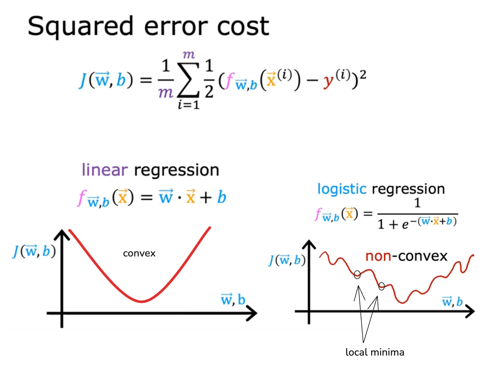

**The Logistic Loss Function**

To fix this, we define a different "loss" for individual training examples ($L(f(x), y)$). The choice depends on the true label $y$:

|**If True Label is...**|**Loss Formula**|**Intuition**|
|---|---|---|
|**$y = 1$**|$-\log(f(x))$|As the prediction $f(x)$ approaches 1, loss goes to 0. If it approaches 0, loss goes to infinity.|
|**$y = 0$**|$-\log(1 - f(x))$|As the prediction $f(x)$ approaches 0, loss goes to 0. If it approaches 1, loss goes to infinity.|

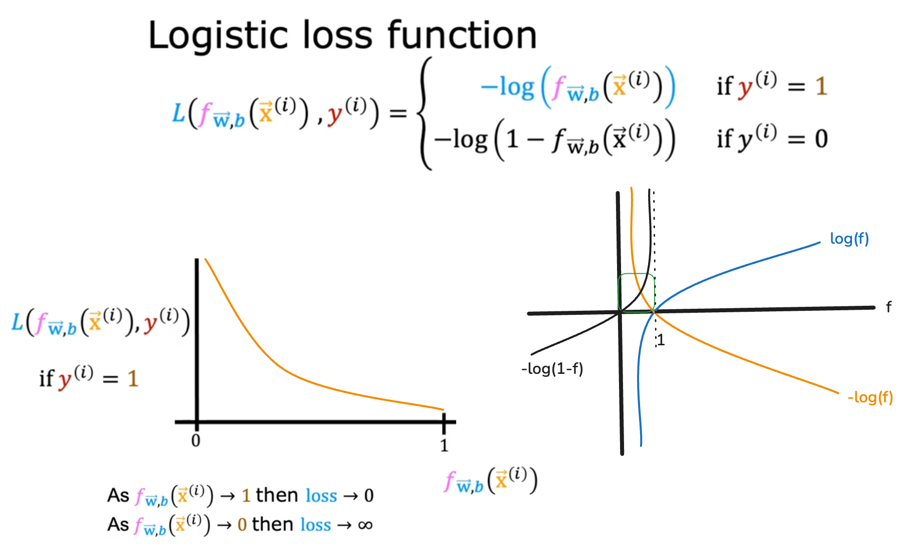

**Why This Works**

- **Accuracy Incentives:** The model is heavily penalized (infinite loss) if it is "confident and wrong"—for example, predicting a 99.9% chance of malignancy when the tumor is actually benign.
    
- **Restoring Convexity:** By summing these specific logarithmic losses across the entire training set, the overall cost function $J(w, b)$ becomes **convex** again.
    
- **Reliability:** With a convex cost function, gradient descent is guaranteed to converge to the global minimum, provided the learning rate is chosen correctly.
    

#### Simplified Cost Function for Logistic Regression

The Simplified Loss Function

Previously, the loss function was defined using two separate cases ($y=1$ and $y=0$). Because $y$ is always a binary value (0 or 1), we can merge them into a single line:

$$L(f_{\vec{w},b}(\vec{x}), y) = -y \log(f_{\vec{w},b}(\vec{x})) - (1 - y) \log(1 - f_{\vec{w},b}(\vec{x}))$$

**Why this works:**

- **If $y=1$:** The second term $(1-y)$ becomes 0, leaving only $- \log(f(x))$.
    
- If $y=0$: The first term $(-y)$ becomes 0, leaving only $- \log(1-f(x))$.
    
    This algebraic trick allows us to use one formula for all training examples regardless of their class.

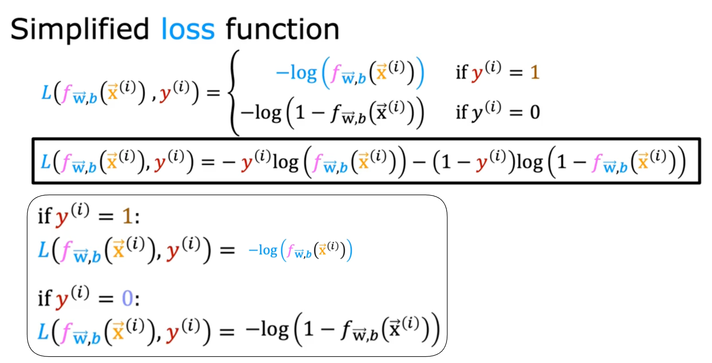

**The Simplified Cost Function**

The cost function $J(\vec{w},b)$ is the average loss across the entire training set of $m$ examples. By pulling the negative sign out, we get the standard equation used by almost all machine learning practitioners:

$$J(\vec{w},b) = -\frac{1}{m} \sum_{i=1}^{m} \left[ y^{(i)} \log(f_{\vec{w},b}(\vec{x}^{(i)})) + (1 - y^{(i)}) \log(1 - f_{\vec{w},b}(\vec{x}^{(i)})) \right]$$

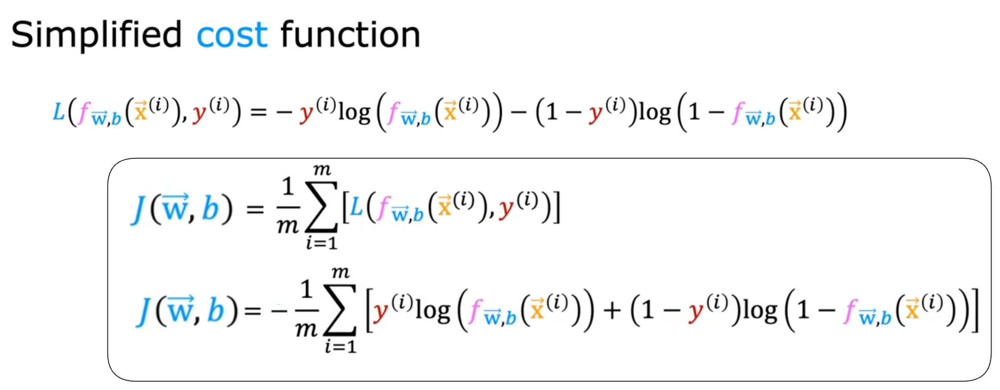

**Rationale: Maximum Likelihood**

While there are many possible cost functions, this specific one is chosen because:

- **Convexity:** It creates a smooth, bowl-shaped surface that guarantees gradient descent will find the global minimum.
    
- **Statistical Foundation:** It is derived from **Maximum Likelihood Estimation**, a principle in statistics for finding the parameters that best explain the observed data.

---

### Gradient Descent for Logistic Regression

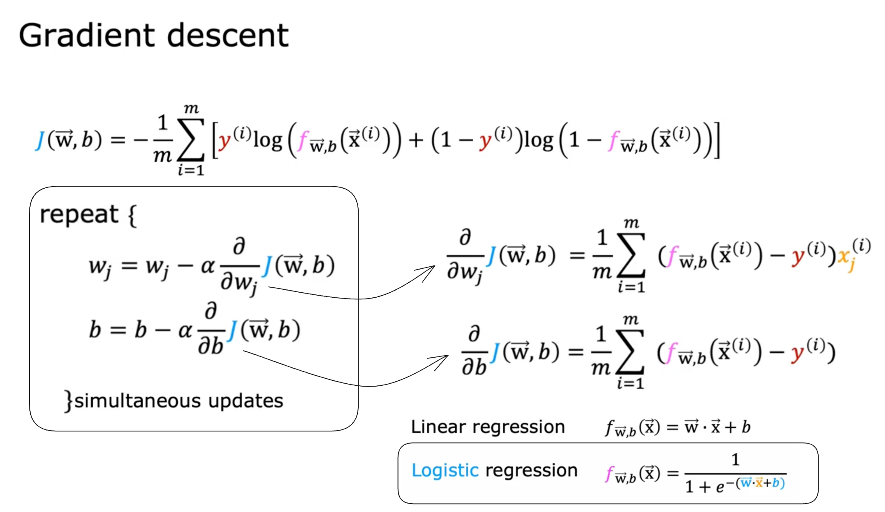

**The Gradient Descent Update Rule**

To find the optimal parameters $\vec{w}$ and $b$, we use the same iterative process as before. We repeatedly perform **simultaneous updates** for all parameters:

- **For $w_j$:** $w_j = w_j - \alpha \frac{1}{m} \sum_{i=1}^{m} (f_{\vec{w},b}(\vec{x}^{(i)}) - y^{(i)})x_j^{(i)}$
    
- **For $b$:** $b = b - \alpha \frac{1}{m} \sum_{i=1}^{m} (f_{\vec{w},b}(\vec{x}^{(i)}) - y^{(i)})$

**Logistic vs. Linear Regression**

You might notice that these update equations look identical to the ones used in linear regression. However, they are **not** the same because the definition of $f(\vec{x})$ has changed:

- **Linear Regression:** $f(\vec{x}) = \vec{w} \cdot \vec{x} + b$
    
- **Logistic Regression:** $f(\vec{x}) = \frac{1}{1 + e^{-(\vec{w} \cdot \vec{x} + b)}}$
    

Because $f(\vec{x})$ is now a Sigmoid function, the gradients actually represent a different slope on a different cost surface.

**Implementation Best Practices**

To make logistic regression work effectively in practice, you should apply the same techniques used for linear regression:

* **Monitor Convergence:** Plot a learning curve (Cost  vs. Iterations) to ensure the cost is consistently decreasing.
* **Vectorization:** Instead of updating  one by one in a loop, use vectorized calculations (via libraries like NumPy) to process all features and examples simultaneously for better speed.
* **Feature Scaling:** Scale your input features (e.g., to a range between -1 and 1) so that the cost function contours are more circular, allowing gradient descent to reach the minimum faster.

**Professional Implementation**

While it is essential to understand how to build this from scratch, most practitioners use **Scikit-learn**. This library allows you to train a robust logistic regression model with just a few lines of code, handling many of the underlying optimizations for you.

---
### The Problem of Overfitting

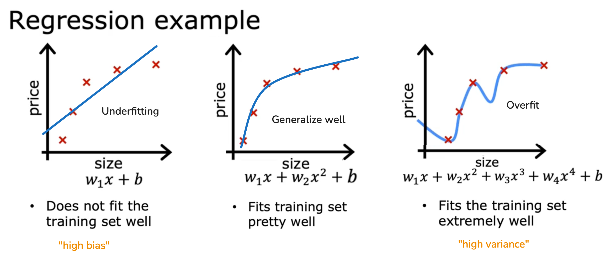

**The Three States of a Model**

When fitting a model (either Linear or Logistic Regression), it generally falls into one of three categories:

| Term             | Also Known As      | Definition                                                                                                                               | Result                                                                                                |     |
| ---------------- | ------------------ | ---------------------------------------------------------------------------------------------------------------------------------------- | ----------------------------------------------------------------------------------------------------- | --- |
| **Underfitting** | **High Bias**      | The model has a strong preconception (bias) that the data is simpler than it actually is (e.g., fitting a straight line to curved data). | It performs poorly on the training data and fails to capture the trend.                               |     |
| **Just Right**   | **Generalization** | The model captures the underlying pattern without being distracted by random noise.                                                      | It makes good predictions on new, unseen data.                                                        |     |
| **Overfitting**  | **High Variance**  | The model fits the training data "too well," capturing every random fluctuation and outlier.                                             | It has zero error on training data but fails miserably on new data because the curve is too "wiggly." |     |

**Overfitting in Classification**

Overfitting is not limited to predicting numbers; it happens in **Logistic Regression** as well.

* **Underfit:** A simple straight-line decision boundary that fails to separate classes properly.
* **Just Right:** A smooth, elliptical boundary that separates most classes but allows for some natural overlap.
* **Overfit:** An incredibly complex, twisted decision boundary that weaves around every single data point to achieve 100% accuracy on the training set, but results in a nonsense boundary for actual diagnosis.

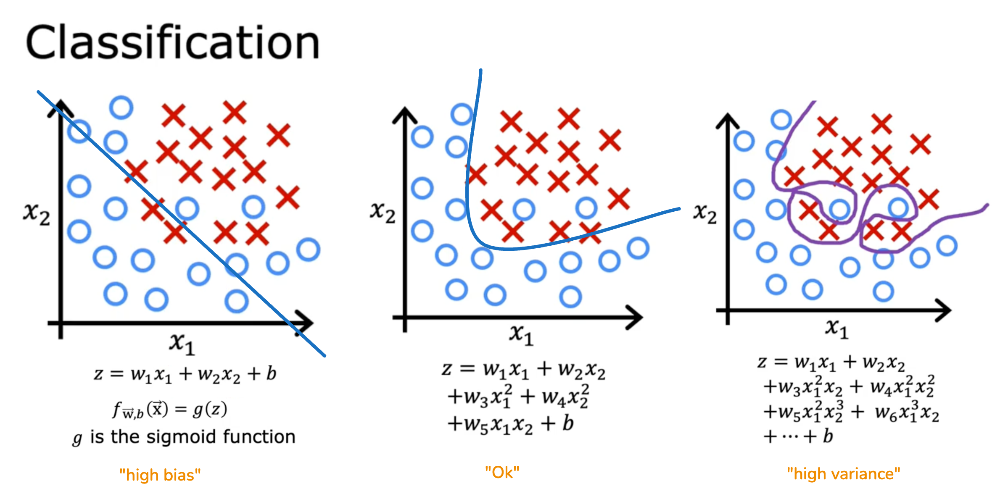

**Note on the Term "Bias"**

In machine learning, "Bias" has two meanings:

1. **Technical Bias (Underfitting):** The mathematical inability of a model to capture the data's complexity.
2. **Societal Bias:** When an algorithm shows unfair prejudice against specific groups (e.g., ethnicity or gender).

#### Addressing Overfitting

**Collect More Training Data**

This is the most effective solution. When an algorithm is overfit, it is "distracted" by the noise or specific quirks of a small dataset.

- **How it works:** By providing a much larger variety of examples, the algorithm is forced to find the broader, smoother trend rather than weaving a "wiggly" line through a few specific points.
    
- **Limitation:** In many real-world scenarios, more data simply isn't available or is too expensive to collect.

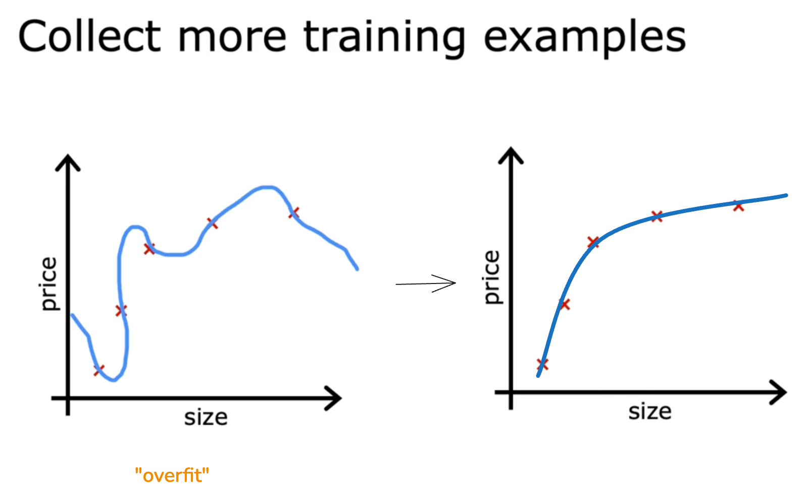

**Feature Selection (Use Fewer Features)**

Overfitting often happens when you have too many features (like $x, x^2, x^3, x^4$) but not enough data to support them.

- **How it works:** You manually or automatically select only the most relevant features (e.g., keeping "house size" and "bedrooms" but dropping "distance to nearest coffee shop").
    
- **Pros/Cons:** It significantly reduces the chance of overfitting, but the downside is that you might accidentally throw away useful information that could have helped the model.

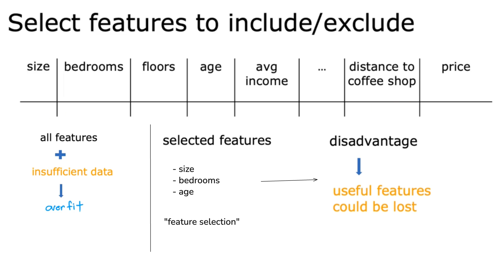

**Regularization**

Regularization is a more sophisticated and popular approach because it allows you to **keep all your features** while preventing any single one from having an unfairly large influence.

- **The Concept:** Instead of setting a parameter to exactly zero (which is what feature selection does), regularization **shrinks** the parameters $w_1, w_2, \dots, w_n$.
    
- **How it works:** It encourages the learning algorithm to keep the parameter values small. Smaller parameters lead to a "simpler," smoother function that is less likely to oscillate wildly or overfit the data.
    
- **Implementation Tip:** By convention, we usually only regularize the weights ($w$), not the bias ($b$), though regularizing $b$ usually makes very little difference in practice.

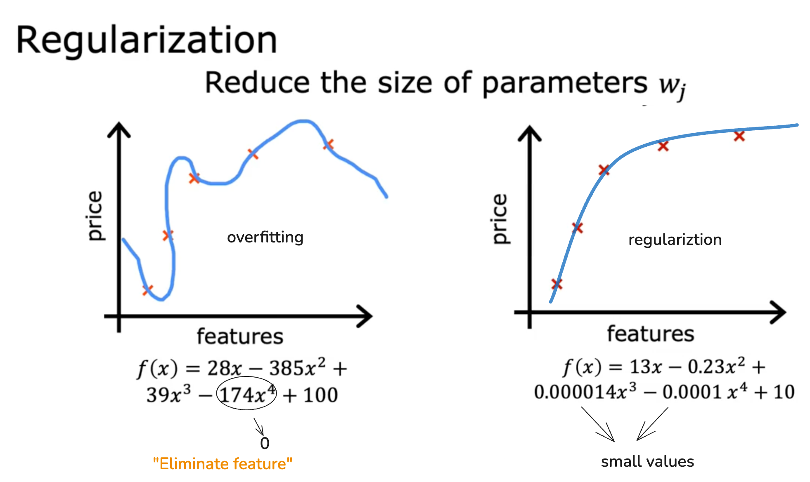

**Summary Table: Addressing Overfitting**

|**Method**|**Action**|**Best Used When...**|
|---|---|---|
|**More Data**|Add more examples|You have access to additional raw data.|
|**Feature Selection**|Drop less useful features|You have way too many features for the amount of data you have.|
|**Regularization**|Shrink parameter values|You want to keep all features but make the model less "wiggly."|

#### Cost Function with Regularization

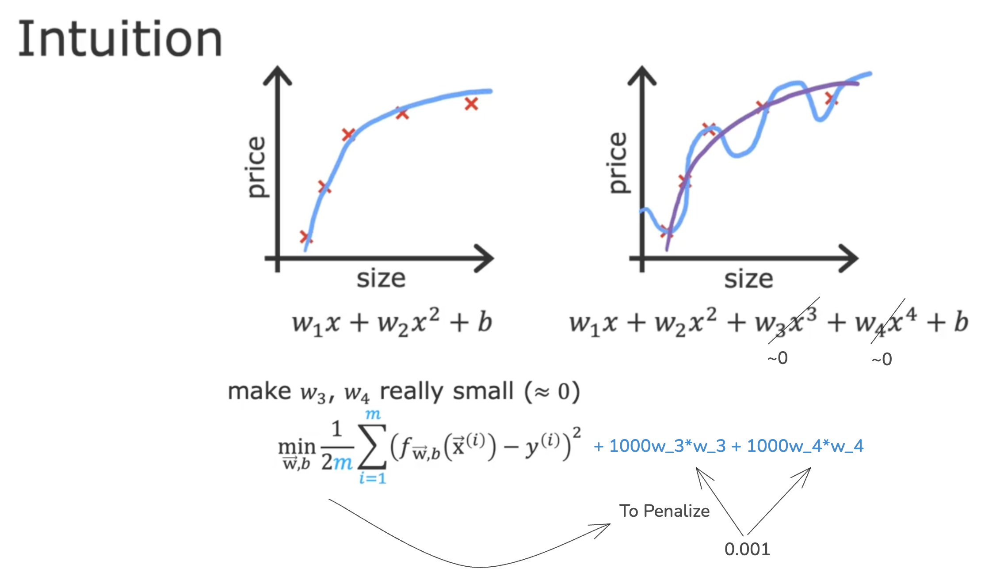

**The Regularized Cost Function**

To prevent the model from becoming too "wiggly" or complex, we add a **Regularization Term** to our original cost function $J(\vec{w}, b)$. The new objective looks like this:

$$J(\vec{w}, b) = \underbrace{\frac{1}{2m} \sum_{i=1}^m (f_{\vec{w},b}(\vec{x}^{(i)}) - y^{(i)})^2}_{\text{Original Cost (Fit the data)}} + \underbrace{\frac{\lambda}{2m} \sum_{j=1}^n w_j^2}_{\text{Regularization Term (Keep } w \text{ small)}}$$

- **Goal 1:** Minimize the first term to ensure the model makes accurate predictions on the training data.
    
- **Goal 2:** Minimize the second term to keep the parameters $w_j$ small, which simplifies the model.
    
- **The Parameter $\lambda$ (Lambda):** This is the **regularization parameter**. It controls the balance (trade-off) between fitting the data well and keeping the model simple.

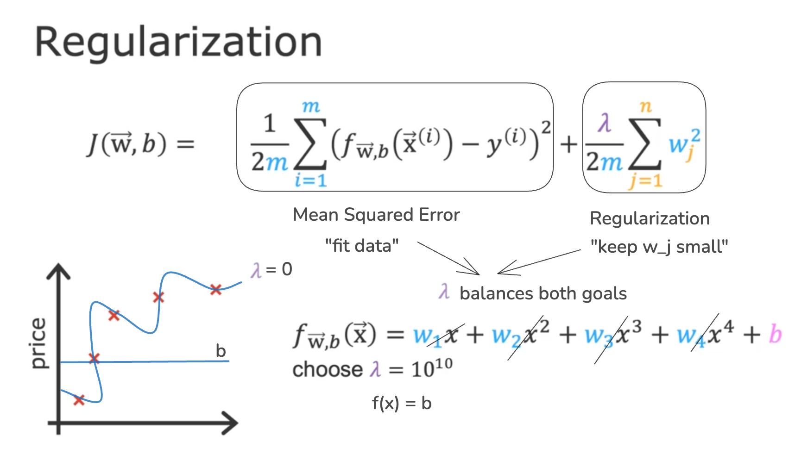

**Choosing the Right $\lambda$**

The value you choose for $\lambda$ significantly impacts whether your model underfits or overfits:

- **$\lambda = 0$ (No Regularization):** The algorithm ignores the penalty term. If you have many features, the model will likely **overfit** and create an overly complex, wiggly curve.
    
- **$\lambda$ is extremely large (e.g., $10^{10}$):** The algorithm is so desperate to make the second term zero that it sets almost all $w_j \approx 0$. This leaves only the bias $b$ ($f(x) \approx b$), resulting in a flat horizontal line that **underfits** the data.
    
- **$\lambda$ is "Just Right":** The algorithm balances the two goals, allowing the model to use all features but preventing any of them from having an exaggerated, "wiggly" impact. This results in a curve that fits the trend but ignores the noise.

**Implementation Details**

- **Scaling by $2m$:** We divide the regularization term by $2m$ (the same as the first term). This ensures that even if your training set size ($m$) grows, your choice of $\lambda$ remains relatively stable and doesn't need to be constantly recalculated.
    
- **Why not regularize $b$?** By convention, we only penalize the weights $w_1, w_2, \dots, w_n$. While you _could_ regularize the intercept $b$, doing so makes almost no difference in practice, so most engineers leave it out.

#### Regularized Linear Regression

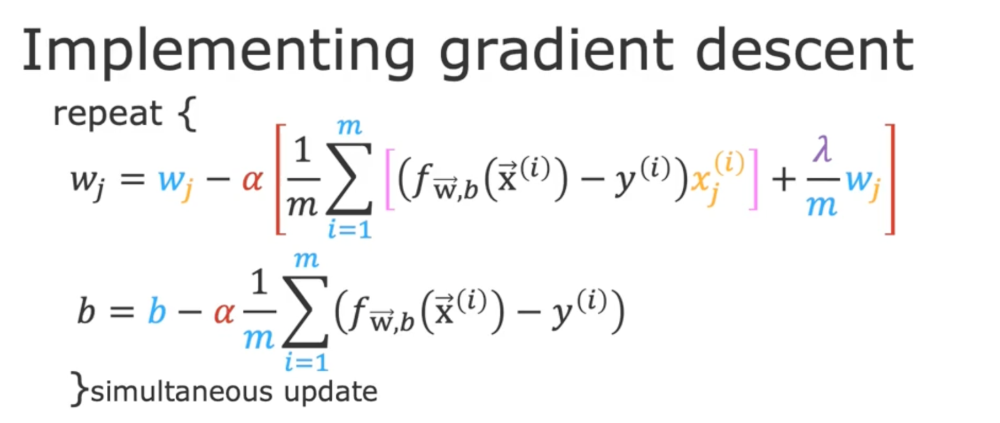

**The Regularized Update Rules**

To minimize the regularized cost function, we update the parameters $w_j$ and $b$ simultaneously. Since we only regularize the weights ($w$) and not the bias ($b$), the update for $b$ remains the same as standard linear regression, while the update for $w$ receives an additional term:

- **For $w_j$:**
    
    $$w_j = w_j - \alpha \left[ \frac{1}{m} \sum_{i=1}^{m} (f_{\vec{w},b}(\vec{x}^{(i)}) - y^{(i)})x_j^{(i)} + \frac{\lambda}{m}w_j \right]$$
    
- **For $b$:**
    
    $$b = b - \alpha \frac{1}{m} \sum_{i=1}^{m} (f_{\vec{w},b}(\vec{x}^{(i)}) - y^{(i)})$$
    

**Intuition: Weight Decay**

If we rearrange the update rule for $w_j$ mathematically, we get a clearer picture of what regularization is actually doing:

$$w_j = w_j \left(1 - \alpha \frac{\lambda}{m}\right) - \alpha \frac{1}{m} \sum_{i=1}^{m} (f_{\vec{w},b}(\vec{x}^{(i)}) - y^{(i)})x_j^{(i)}$$

- **The "Shrinkage" Factor:** On every iteration, $w_j$ is multiplied by $(1 - \alpha \frac{\lambda}{m})$.
    
- Because $\alpha$, $\lambda$, and $m$ are positive, this multiplier is a number **slightly less than 1** (e.g., $0.9998$).
    
- **The Result:** Before the algorithm even looks at the data to see which way to move $w_j$, it first "shrinks" the weight slightly toward zero. This is why regularization is sometimes referred to as **Weight Decay**.
    
**Mathematical Derivative**

For those interested in the calculus, the new term $\frac{\lambda}{m}w_j$ comes directly from taking the derivative of the regularization term $\frac{\lambda}{2m} \sum w_j^2$. The exponent $2$ pulls down to cancel out the $2$ in the denominator, leaving behind the simple linear penalty $\frac{\lambda}{m}w_j$.

#### Regularized Logistic Regression

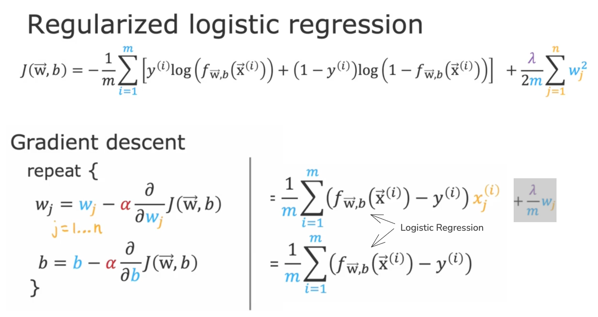

**The Regularized Cost Function**

When a logistic regression model uses high-order polynomials, the decision boundary can become overly complex. To fix this, we add the same regularization term to the classification cost function:

$$J(\vec{w}, b) = \text{Original Logistic Cost} + \frac{\lambda}{2m} \sum_{j=1}^{n} w_j^2$$

By minimizing this new cost function, the algorithm is penalized for having large weights ($w_j$), which encourages a smoother, more "reasonable" decision boundary that generalizes better to new patients or data points.

**Gradient Descent Implementation**

The update rules for regularized logistic regression are mathematically identical to those for regularized linear regression. The only difference is the definition of :

- The Update for $w_j$:
    
    $$w_j = w_j - \alpha \left[ \frac{1}{m} \sum_{i=1}^{m} (f_{\vec{w},b}(\vec{x}^{(i)}) - y^{(i)})x_j^{(i)} + \frac{\lambda}{m}w_j \right]$$
    
- The Update for $b$:
    
    $$b = b - \alpha \frac{1}{m} \sum_{i=1}^{m} (f_{\vec{w},b}(\vec{x}^{(i)}) - y^{(i)})$$
    

Crucial Distinction: Even though the formula looks the same, remember that for logistic regression:

$$f_{\vec{w},b}(\vec{x}) = \frac{1}{1 + e^{-(\vec{w} \cdot \vec{x} + b)}}$$

