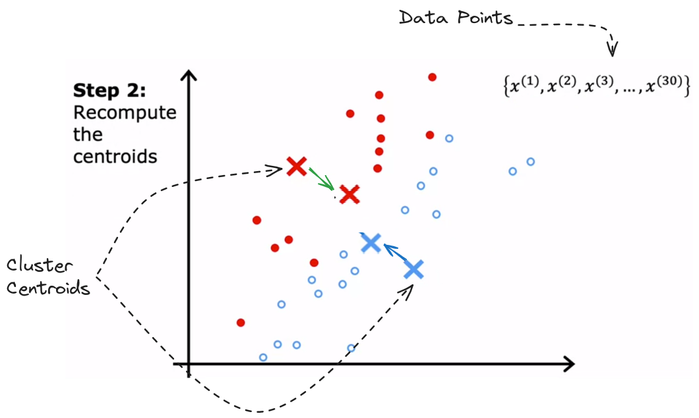

# Unsupervised Learning
## Learning Objectives

- Implement the k-means clustering algorithm
- Implement the k-means optimization objective
- Choose the number of clusters for the k-means algorithm
- Implement an anomaly detection system
- Decide when to use supervised learning vs. anomaly detection
- Implement the centroid update function in k-means
-  Implement the function that finds the closest centroids to each point in k-means
## Clustering
**What is clustering?**

A clustering algorithm looks at a number of data points and automatically finds data points that are related or similar to each other.

Given a dataset with features `x1`, `x2` and so on. With supervised learning, we have a training set with both the input features `x` as well as the labels `y`. We could plot a dataset as shown in figure above and fit, say, a logistic regression algorithm or a neural network to learn a decision boundary. 

In unsupervised learning, the dataset typically consists of only the input features `x` , without any corresponding target labels `y`. Consequently, when visualizing such data, it appears as scattered dots rather than distinct classes. The absence of target labels means the algorithm cannot be directed towards predicting specific "right answers" `y`. Instead, the objective shifts towards uncovering intriguing patterns or structures inherent within the data itself.

Clustering algorithms aim to identify distinct structures within data. Specifically, clustering algorithms analyze datasets to determine if they can be partitioned into clusters, representing groups of similar data points. For instance, in a dataset depicted as dots on a graph, a clustering algorithm might recognize two clusters, each comprising points with shared characteristics.
## Application of Clustering
- Grouping Similar News Articles
	- Clustering facilitates the organization of news articles based on similarities in content.
	- This aids in content recommendation and personalized news feeds.
- Market Segmentation
	- Clustering helps segment customers based on behavior and preferences.
	- Business utilize these segments for targeted marketing and product development strategies.
- DNA Data Analysis
	- Clustering is applied to genetic expression data to group individuals with similar traits.
	- This assists in genetic research and personalized medicine.
- Astronomical Data Analysis
	- Astronomers employ clustering to group celestial bodies in space for analysis.
	- This aids in understanding galaxy formations and spatial structures.

## K-means Intuition
The K-means clustering algorithm is introduced as a method for partitioning unlabeled datasets into clusters based on similarities. In this example, a dataset containing 30 unlabeled training examples is plotted.
**Initialization of Cluster Centers**
Initially, the K-means algorithm randomly selects the positions of cluster centers. In this example, two clusters are chosen, represented by a red cross and a blue cross. The selected cluster centers are merely initial guesses and may not accurately represent the actual centers of clusters in the dataset. These random guesses serve as starting points for the clustering process.

The K-means algorithm operates repeatedly two main tasks:
1. Assign each point to its closest centroids.
2. Move the cluster centroids.

The first thing the K-means algorithm does is to decide which cluster each data point belongs to. It starts by guessing where the centers of the clusters might be. Then, for each data point, it checks if it's closer to one cluster center or the other. Based on this, each point is assigned to the closest cluster. 

  
The second step of the K-means algorithm involves updating the positions of the cluster centroids based on the average location of the data points assigned to each cluster.
First, the algorithm calculates the average location of all the red points and moves the red cluster centroid to this new average position. Similarly, it computes the average location of all the blue points and relocates the blue cluster centroid accordingly. This process ensures that the cluster centroids accurately represent the center of their respective clusters by moving them to the average position of the data points assigned to each cluster.

